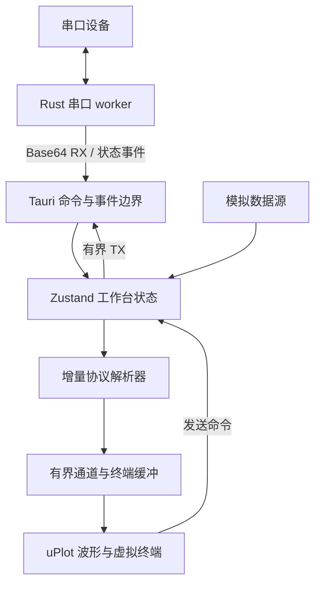
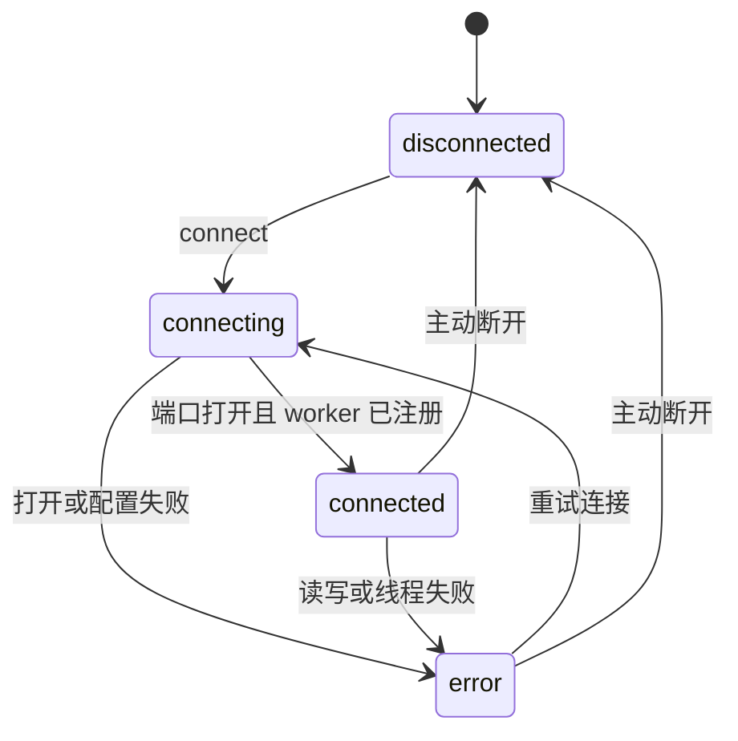

# 架构说明

本文描述 v0.1.0 的实际实现和边界。架构目标不是追求模块数量，而是让串口生命周期、数据所有权和故障语义
足够清楚，使后续记录回放、协议扩展和插件系统可以增量加入。

## 总体结构

- Rust 独占串口句柄，WebView 不直接访问设备资源。
- Tauri 命令负责离散操作，事件负责持续 RX、TX 回执和连接状态。
- 模拟器与真实串口共用 `ingestBytes` 入口，避免维护两套协议和视图逻辑。
- 协议层只输出时间戳和值数组，不依赖 React、Tauri 或具体图表库。

## 串口生命周期

`connect_serial`、`disconnect_serial` 通过独立生命周期锁串行执行。每个 worker 都有 generation，所有状态
变化都带单调递增的 revision。

连接过程先打开并配置端口，再创建一个等待启动信号的线程。worker 注册到权威状态后才发布 `connected` 并
解除启动屏障，因此前端收到连接事件时已经可以安全发送或断开。

命令返回值与异步事件都包含 revision。前端只接受不早于当前 revision 的状态，避免较慢的命令响应覆盖较新的
拔插或读写错误。

## Worker 调度与边界

worker 使用原子取消标记，断开不需要向可能已满的 TX 队列阻塞写入控制消息。发送数据按 4 KiB 分块，每轮
最多写 32 KiB，之后必须执行一次读取，从而避免持续发送长期饿死 RX。

| 资源 | v0.1 上限 | 目的 |
| --- | ---: | --- |
| 单次串口发送 | 64 KiB | 限制单条命令的阻塞时间与内存占用 |
| TX 队列 | 256 条 | 提供背压，满载时向 UI 返回明确错误 |
| 串口读取块 | 16 KiB | 控制单次事件负载 |
| 通道数量 | 16 | 防止异常帧创建无限序列 |
| 每通道点数 | 2,000 | 固定波形历史内存 |
| 终端记录 | 800 条 | 固定终端历史内存 |
| 单条终端展示 | 2,048 字节 | 避免超大帧撑大 DOM 和字符串 |

当前手工发送面向命令与短帧。大文件传输将在后续版本使用独立的流式任务、进度和取消协议，不通过扩大上述
上限实现。

## 协议与显示

- FireWater 使用流式 `TextDecoder`，按 LF / CRLF 增量切帧，支持 `label:value` 命名通道。
- JustFloat 在字节层查找 `00 00 80 7F` 帧尾，并以小端序解析 `float32`。
- Raw Data 不尝试猜测结构，仅保留终端数据。
- 暂停波形只停止向波形缓存追加，RX、协议解析、终端和统计继续运行。
- 暂停终端只停止创建展示记录，RX、波形和统计继续运行。

终端使用虚拟列表，DOM 数量与视口高度相关，而不是与 800 条缓存上限线性增长。uPlot 只接收当前时间窗内的
对齐数组。

## 安全边界

- capability 仅启用 `core:default`，未开放文件系统、进程、Shell 或 opener 权限。
- CSP 默认只允许自身资源，并显式禁用 `base-uri`、`object-src` 和 `frame-src`。
- 窗口保持不透明和系统装饰，避免透明窗口带来的可读性与平台兼容问题。
- 主 WebView 不执行动态字符串代码；协议扩展不能依赖 `eval` 或 `new Function`。
- 串口数据视为不可信输入，解析器和展示层都必须保持长度上限。

## 故障语义

- 端口打开或参数配置失败：命令返回可读错误，状态进入 `error`。
- 队列满或单次发送过大：只拒绝当前发送，不破坏现有连接。
- 设备移除或读写失败：worker 发布 `error` 并停止，下一次连接会先回收旧线程。
- worker panic：`join` 错误不会静默丢弃，权威状态进入 `error`。
- 浏览器预览：串口入口禁用，只允许使用模拟器。

## 验证层次

1. Vitest 覆盖字节编解码、跨 chunk 协议解析、环形缓冲和状态 revision。
2. React 组件测试覆盖主要空状态与操作入口。
3. Playwright 覆盖模拟器端到端链路、TX 回显、Canvas 有效像素、虚拟列表和窄屏溢出。
4. GitHub Actions 在三个桌面系统检查 Rust，在 Node.js 22 上执行前端检查和浏览器验收。
5. 正式发布前必须补充真实串口的长稳、拔插、流控和高波特率测试。

## 扩展原则

新协议先实现无副作用的增量解析器和夹具测试，再注册到 UI。工作区、记录回放和插件系统必须复用同一数据
平面，不允许绕过缓存上限。节点图仅适合可选的高级数据处理，不应成为基础收发、波形或协议配置的前置条件。
