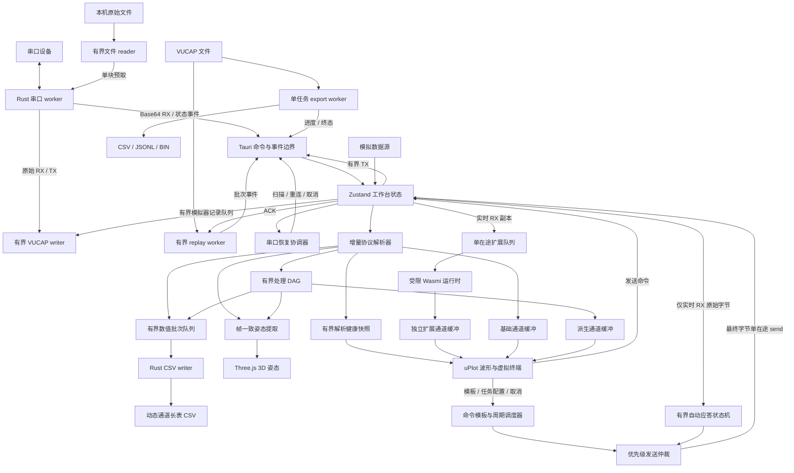
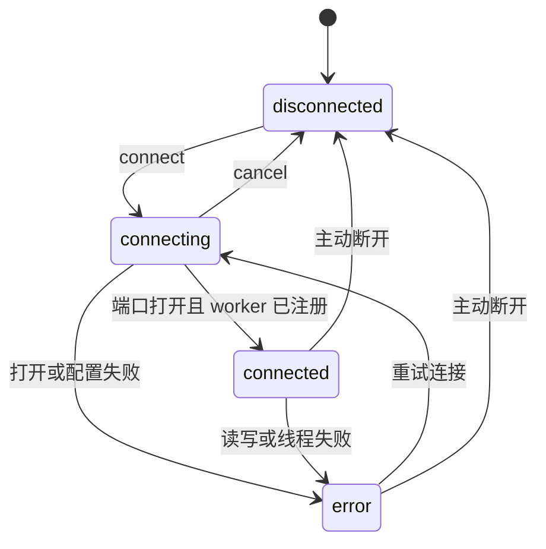

# 架构说明

本文描述 v0.1.0 基础、已落地的 v0.2 工作区/录制/回放/串口恢复/波形测量，以及 v0.3 命令工作流、原始文件发送、
RX 自动应答、协议解析健康度、流式导出、有界数据处理图、实验性 Wasm 实时附加解析器、实时数值日志和帧一致
3D 姿态视图，以及有界实时通道监视。
架构目标不是追求模块数量，而是让串口生命周期、数据所有权和故障语义保持清楚。

## 总体结构

- Rust 独占串口句柄，WebView 不直接访问设备资源。
- Tauri 命令负责离散操作，事件负责持续 RX、TX 回执和连接状态。
- 模拟器与真实串口共用 `ingestBytes` 入口，避免维护两套协议和视图逻辑。
- 协议层只输出时间戳、值数组和固定健康快照，不依赖 React、Tauri 或具体图表库。

## 模拟信号数据链路

模拟器配置只包含固定信号 ID、`1..16` 通道数和 `10/25/50/100/200 Hz` 采样率。纯生成器使用
`sampleIndex / sampleRate` 计算逻辑时间，不读取墙钟或 `performance.now()`；相同配置和样本序号始终得到相同数值。
均匀随机和白噪声由样本序号、通道号和固定流 ID 经无状态 32 位哈希生成，白噪声再使用 Box-Muller 变换并限制
到有限幅值，因此测试不依赖可变 RNG 状态。

连接时运行时冻结配置，定时器每次只生成一个样本并交给当前结构化协议的 `encodeSimulatorSample`，不会补发页面
挂起期间遗漏的样本。停止会清理定时器；再次启动创建新的样本计数器并从 0 开始。内置波形模拟只支持
FireWater 与 JustFloat，二者使用各自协议帧并复用 `ingestBytes`、录制和统计入口。Raw Data 不提供数值波形模拟，
也不定义或解析私有二进制帧；它只按原样承载真实串口或回放中的原始字节，供终端、录制和统计使用。选择 Raw Data
时不会启动模拟器。若未来增加 Raw 模拟，必须由用户明确输入 HEX 载荷和发送间隔，按原始字节发送，不能从数值
通道隐式生成帧格式。运行中修改配置由 UI 和 Store 双层拒绝，避免一个连接代次内混合两套时间与通道语义。

## 串口生命周期

`connect_serial` 把可能阻塞的设备打开和配置放入阻塞任务，避免占用 Tauri 异步执行线程；连接和断开通过独立
生命周期锁串行执行。每个连接请求都有 request token，每个 worker 都有 generation，所有状态变化都带单调递增
的 revision。

连接命令在派发阻塞任务前登记 request token；任务取得生命周期锁后只有 token 仍为当前请求，才推进 generation
并发布 `connecting`。设备打开、DTR / RTS 配置和 worker 注册前后都会同时校验 token 与 generation。连接过程创建
一个等待启动信号的线程，worker 注册到权威状态后才发布 `connected` 并解除启动屏障，因此前端收到连接事件时
已经可以安全发送或断开。

`cancel_serial_connect` 只需要短暂取得共享状态锁，不等待可能正在打开设备的生命周期锁。取消会清除 request
token；已经进入 `connecting` 时还会推进 generation 并发布 `disconnected`。排队、设备打开、线路配置或 worker
注册阶段的迟到结果因此都不能重新发布 `connecting` / `connected` 或注册旧 worker。

命令返回值与异步事件都包含 revision。前端事件订阅只接受严格更新的 revision，避免重复事件重置恢复协调器，
也避免较慢的命令响应覆盖较新的拔插或读写错误。唯一例外是取消命令返回的权威稳定快照：当 revision 相同且本地
仍处于乐观 `connecting` 时，用它恢复连接与事务状态，但不再次驱动恢复协调器。错误状态另外携带稳定
`errorCode`，面向 UI、恢复策略和诊断报告；原始错误文本只用于当前界面提示，不作为程序控制条件。

设备列表在桌面运行时冷启动、连接面板打开、窗口重新聚焦或页面恢复可见时刷新。后台刷新只在串口数据源未连接且
录制、回放、恢复和运行时事务均空闲时启动；失败不覆盖连接错误或用户状态消息，生命周期变化后的迟到结果会被
丢弃。列表按端口名自然排序，保留暂时离线的当前选择。界面可显示厂商、产品和 VID:PID，但只暴露是否存在强 USB
身份，不显示完整序列号。

Windows 驱动枚举和端口打开/初始化分别使用 5 秒 deadline，并各自最多保留两个尚未返回的底层调用。超时后前端
立即恢复可操作状态，打开期间不持有串口生命周期锁；迟到的端口句柄会直接销毁，不能安装 worker 或覆盖新代次。
达到未返回调用上限时会在创建新线程前拒绝请求，避免异常蓝牙或虚拟串口驱动造成后台线程持续累积。

连接后的 DTR / RTS 请求携带 generation，并进入持有串口句柄的唯一 worker。worker 调用驱动成功后才向前端
回执并更新工作区配置；迟到回执不会覆盖新连接。硬件流控接管 RTS 时前后端都拒绝手动操作，文件发送和 Modbus
RTU 事务期间也保持控制线不变。最后一次成功值会同步给恢复协调器，自动重连沿用该值。

同一 worker 每 200 ms 轮询一次 CTS、DSR、RI 和 DCD（CD）。四路读取彼此隔离，单路驱动错误映射为 `null`，不会结束
串口连接；只有快照变化时才发布 `serial://modem-status`。该事件使用独立 generation 和 revision，前端先订阅事件、
再读取 `get_serial_modem_status` 快照，并只接受当前连接的递增 revision。输入线状态是会话级只读数据，不进入
`SerialConfig`、工作区持久化、协议解析、处理图或录制链路。

## 可控串口恢复与诊断

自动重连由前端恢复协调器管理，默认关闭，只能在当前桌面应用运行期显式启用，不写入工作区或 Zustand 持久化
字段。一次手动连接成功后，仅当端口同时具有 USB VID、PID 和非空序列号时才进入待命；恢复目标不包含旧端口名。
身份缺失时保持阻塞状态，不退化为按端口名或同型号设备猜测。

意外运行故障会先等待当前捕获文件完成收尾，再按 `0 / 0.5 / 1 / 2 / 4 / 8 / 16 / 30 / 30 / 30` 秒执行最多
十次恢复。每次尝试重新枚举端口，只连接唯一精确匹配 VID、PID 和序列号的设备，因此同一设备改用新端口名仍可
恢复。无匹配设备会进入下一次退避；多个匹配候选、身份不完整或录制收尾失败都会停止自动选择并明确提示用户。

恢复协调器用 epoch 隔离迟到的枚举和连接 Promise。手动连接、断开、切换数据源或工作区、打开回放和运行时卸载
都会取消当前 epoch；正在连接时还会调用后端取消命令。恢复成功后重置协议 parser、流式 `TextDecoder` 和统计
起点，保留已有波形与终端历史。

诊断使用 256 条内存环，JSON 导出上限为 128 KiB。报告只包含稳定错误码、相对时间、重试计数、generation、
revision 和脱敏串口参数；不包含端口名、USB 序列号、原始错误、绝对路径或 RX / TX 数据。应用版本与标题栏均由
构建从 `package.json` 注入，Tauri/Cargo 清单由 package gate 交叉校验。大小超限时从最旧事件开始裁剪，并保留
丢弃计数。

## Worker 调度与边界

worker 使用原子取消标记，断开不需要向可能已满的 TX 队列阻塞写入控制消息。发送数据按 4 KiB 分块，每轮
最多写 32 KiB，之后必须执行一次读取，从而避免持续发送长期饿死 RX。

| 资源 | 当前上限 | 目的 |
| --- | ---: | --- |
| 单次串口发送 | 64 KiB | 限制单条命令的阻塞时间与内存占用 |
| TX 队列 | 256 条 | 提供背压，满载时向 UI 返回明确错误 |
| 串口读取块 | 16 KiB | 控制单次事件负载 |
| 基础通道数量 | 16 | 防止异常帧创建无限序列 |
| 派生通道数量 | 16 | 保持处理结果和绘图序列有界 |
| 每通道点数 | 12,000 | 覆盖 200 Hz 内置模拟器的 60 秒窗口，并固定波形历史内存 |
| 通道监视统计 | 每通道最多扫描末尾 256 个源条目 | 固定一次渲染的统计工作量 |
| 处理图 | 64 节点、单批 1,000,000 次求值 | 限制编译规模和同步处理时间 |
| 移动平均状态 | 单窗口 256、总容量 8,192 | 固定有状态滤波器内存 |
| 终端记录 | 800 条 | 固定终端历史内存 |
| 终端未结束 RX 行 | 2,048 字节；完整行可另含最多 2 字节 CRLF | 无行尾输入不能无限累积 |
| 单条终端展示 | HEX 2,050 字节；TEXT 2,050 个解码字符 | 完整保留最大正文与 CRLF，同时约束 DOM 和字符串 |
| 命令历史 | 100 条且 payload 合计 256 KiB | 固定会话历史内存并避免隐式持久化 |
| 命令模板 | 256 KiB、256 个变量、token 64 字符 | 限制扫描与展开成本，拒绝超大输入 |
| 快捷命令 | 32 条、名称 64 字符、模板合计 128 KiB | 限制工作区持久化和同步校验成本 |
| 周期发送任务 | 1 个任务、1 个在途 `send()` | 不重入、不追赶遗漏周期、不制造突发队列 |
| 原始文件发送 | 1 个任务、64 KiB 读取块、1 个预取块 | 内存不随文件大小增长，避免文件 I/O 阻塞串口 worker |
| 自动应答规则 | 16 条、触发 256 B、响应模板 4 KiB | 限制配置与同步匹配规模 |
| 自动应答运行时 | FIFO 32、单批匹配 64、会话 1,000 次 | 限制回显环路与发送占用 |
| Modbus RTU 事务 | ADU 256 B、值文本 8,192 字符、单在途、观察 64 KiB、结果 32 条 | 限制输入、响应关联和会话内存 |
| Modbus RTU 只读轮询 | 1 个任务、1 个在途事务、间隔 100 ms 到 24 小时 | 不重入、不追赶遗漏周期、不制造请求积压 |
| 捕获导出 | 1 个任务、单条记录最多 64 KiB | 保持 O\(单记录\) 内存并隔离磁盘任务 |
| 回放索引 | 最多 65,536 个检查点，约 2 MiB | 长文件自压缩步长，定位内存保持硬上限 |
| 双游标测量与区间统计 | 单个选中通道、最多 12,000 点 | 固定扫描范围，不随通道总数扩张 |
| 姿态视图状态 | 最新完整帧、一个冻结样本、一个归零四元数 | 不累积独立姿态历史 |

当前手工发送仍面向命令与短帧。原始文件发送使用独立状态机，不扩大 64 KiB 单次命令上限，也不把完整文件放入
WebView 或 Rust 内存。前端文件对话框只把路径保存在组件草稿中，并在用户显式开始时作为一次 IPC 参数交给 Rust；
Rust 打开句柄、确认普通文件并冻结开始时长度，对前端状态只发布 basename、总字节、已写入字节、generation、
revision、时间和稳定错误码，不回传完整路径。

每个任务创建一个文件 reader 线程，以 64 KiB 为最大读取块并通过零容量同步通道（rendezvous）交接；reader
最多在自身线程中持有一个待交接的预取块，串口 worker 继续按
最多 4 KiB 的底层写块和每轮 32 KiB 预算推进，之后回到 RX。文件增长部分不会越过冻结长度，发送期间截短则以
`source-truncated` 失败。每次底层写入成功的字节立即进入 VUCAP TX record；终端、统计和进度按有界批次发布，
取消或写入失败时会补记当前块中已经成功写入的前缀。

任务阶段由共享原子状态协调 `queued / transmitting / cancel-requested / draining`。取消可在排队或写入阶段竞争
成功；所有字节写入后先进入不可取消的 draining，再执行 `flush`，只有成功才发布完成。取消不声称撤回驱动已缓冲
字节。后端与前端同时拒绝手动、周期、自动应答以及 Modbus 事务/轮询交错；断连、重连、换源、工作区、回放和
卸载会走同一
取消/终态边界。首版不定义线路协议、ACK、重试、限速、续传或接收文件，这些不能由“写入完成”状态替代。

终端虚拟列表的跟随挂起属于组件临时视图状态。自动滚动开启时，用户离开末尾超过一行会停止后续
`scrollToIndex`；手动滚回末尾或点击“回到最新记录”会恢复。挂起不调用 `setTerminalPaused`，RX、解析、录制、
统计和 800 条有界终端历史继续推进；满载头删旧记录时，虚拟器用稳定记录 ID 保持当前浏览锚点。关闭工作区自动
滚动时，该按钮只执行一次跳转；重新开启自动滚动会明确恢复跟随。挂起状态不会进入 store、工作区 schema 或
浏览器持久化，终端记录清空后会复位。

终端时间列的 `absolute / relative / interval` 只改变虚拟行文本。绝对模式复用模块级 `Intl.DateTimeFormat`；相对
模式固定用当前有界缓存的 `entries[0]`，间隔模式按筛选后的 `visibleEntries[index - 1]` 计算，不依赖前一行是否
挂载在 DOM。第一条可见记录显示 `--`，倒退时间保留负号；这是必要行为，因为 RX 行以首块时间戳记时，却可能在
更晚 TX 后才完成并追加。`<time>` 的 `dateTime` 始终保留原始 ISO 绝对时间，搜索仍只检查 payload。导出无论
选择哪种范围都写原始 ISO 绝对时间。模式使用独立 UI 本地键，不进入 Store、工作区 v13 或捕获格式。

终端导出菜单直接接收当前有界 `entries` 或同一轮渲染计算出的 `visibleEntries` 快照，不修改 Store。后者已经
应用当前 TEXT/HEX payload、字面量查询和方向筛选，因此导出与列表、命中数和 ΔT 使用相同的可见集合并保持原
顺序；未启用搜索/方向筛选或集合为空时不能触发当前视图下载。序列化固定写绝对 ISO 时间、方向、字节数和当前
显示 payload 四列，并将 payload 中的反斜杠、Tab、CR、LF 转义，保证每条缓存记录只占 TSV 的一行。该日志仍
是有界展示导出，不改变 VUCAP 原始字节平面或捕获边界。

RX 终端的 `chunk` 模式保持旧行为，每个原始读取块立即形成一条记录。`line` 模式在展示层按原始字节寻找配置的
LF、CRLF 或 CR，允许分隔符、行内容和多字节字符跨越任意读取块；完整后才统一解码，并以该行首个读取块的
时间戳作为记录时间。行尾属于记录字节和字节计数的一部分。未遇行尾的已确认正文超过 2,048 字节后，前 2,048
字节会形成有界分段并标记 `overflow`；完整行加 CRLF 最多 2,050 字节，可在终端中完整显示。

RX TEXT 解码器使用工作区白名单 `utf-8 / gb18030 / windows-1252`。实时与回放分别持有流式解码器，按行模式先
完成原始字节聚合再解码；人工 2,048 字节分段继续以流式状态连接，避免在多字节字符中间截断展示。切换编码只
影响后续记录：当前残行先由旧解码器结算，随后两条 RX 解码状态一起重置，已有 TEXT 不重算。TEXT 自动应答触发
也按启动时冻结的 RX 编码生成匹配字节。

TX 文本编码独立使用同一白名单。手动发送、周期任务与自动应答响应按启动或派发时选择的编码生成线路字节；HEX、
校验尾和 `CR/LF/CRLF` 固定字节不依赖文本编码器。实时 TX 事件携带本次文本编码供终端正确解码，周期任务和自动
应答启用后锁定相关编码选择。VUCAP 仍只保存原始字节，不保存文本编码元数据，因此历史回放的非 UTF-8 TX 应以
HEX 为准，当前 TEXT 回放回退为 UTF-8。

连接或数据流结束、终端暂停、切换 RX 模式或接收行尾时，已有残片会先形成 `unterminated` 警示记录；暂停期间
不会缓存 RX，恢复后从新记录开始。“清空终端”会明确丢弃残片。来源、协议、工作区和回放时间线改变时，运行时
按各自既有清理语义重置；实时与回放使用互不共享的聚合器，回放自然结束时同样保留可见残行。该层不改变协议
parser、处理、统计、自动应答或 VUCAP 的原始读取/记录边界。

## 有界命令工作流

命令历史与周期任务都属于前端会话运行数据，不进入工作区 schema、Zustand 持久化字段或串口诊断。历史条目
保存原始输入、TEXT / HEX、文本编码、校验模式、行尾、变量数、最近展开字节数和发送时间；只有发送队列接受命令
后才写入。连续 TEXT 条目只有在 payload、格式、编码、校验模式和行尾均相同时才更新重复计数；HEX 忽略不参与
线路字节的文本编码。每次追加同时按 100 条和 256 KiB 原始输入字节裁剪，单条超过总预算时不进入历史。输入框
浏览历史前保存 payload、格式、编码、校验模式和行尾草稿，回到末尾时整体恢复；终端输出仍使用浏览器原生文本
选择，不接管拖选手势。

命令模板由纯 TypeScript 线性扫描器编译为只读 literal / variable token，不使用 `eval`、`Function` 或通用模板
引擎。TEXT 变量输出 UTF-8；HEX 变量直接编码为显式定宽无符号字节，变量两侧 HEX 字面量分别满足完整字节边界。
模板最大 256 KiB、最多 256 个变量、单 token 最多 64 字符；渲染器在合并前逐块核对最终 64 KiB 上限。

手动与周期发送共用线性构帧顺序：先展开 TEXT/HEX 模板得到 payload，再只对该 payload 计算原始校验字节，最后
追加 TX 行尾。工作区模式可选 `none`、CRC-16/MODBUS LE/BE、CRC-32 LE/BE、XOR-8 和 SUM-8；完整 payload、
校验尾与行尾合计不得超过 64 KiB。历史恢复当次模式，工作区结构化比较也包含该字段。自动应答使用规则自身的
模板与行尾，Modbus 事务使用专用 ADU，原始文件发送使用文件字节流，三者都绕过这项全局设置。

字节/数值互转是一个无副作用的前端诊断边界，不属于发送链、协议 parser 或处理 DAG。纯 TypeScript 转换器
使用 `DataView` 对 `u8/i8/u16/i16/u32/i32/f32/f64` 执行明确 LE/BE 读写；HEX 解码先验证完整字节和类型
对齐，数值编码则严格验证分隔、整数性、范围和有限性。`f32` 编码后回读实际 IEEE 754 值，不显示无法编码的
高精度十进制假象。

输入文本最多 256 KiB，参与转换的字节数据最多 64 KiB，单个数值 token 最多 128 字符。UI 只保留弹层内局部状态，
不读实时 RX、不写 Store 或工作区、不改发送草稿且不调用发送 API；剪贴板仅在用户显式复制某个结果时访问。处理链内的
数据语义转换必须另行定义输入/输出通道、帧与批次时序、故障传播和持久化，不会因为弹层存在而被视为已集成。

命名快捷命令是工作区配置，不属于会话历史。解析器要求精确字段、唯一稳定 ID、无控制字符名称和合法模板，按
UTF-8 累加全部原始模板；数组顺序就是显示、持久化和导出顺序。保存和载入都不调用发送 API：载入只把原始模板、
格式和行尾应用到草稿，变量直到用户显式手动发送或启动周期任务才展开。快捷命令不保存或恢复校验模式，实际发送
使用当前工作区设置。空模板仅在 LF/CR/CRLF 能产生非空字节时合法。快捷命令不会进入串口诊断，但其原文会进入
本机持久化状态和工作区导出。

周期发送由可注入时钟的纯 TypeScript 协调器管理。启动时编译并冻结原始模板、格式、校验模式、行尾与任务起始时间；
首个序号为 1，后续每次派发使用 `sentCount + 1` 和一次当前时间采样重新渲染 payload，再按冻结模式计算该轮
校验尾。序号只有发送成功后才推进，渲染或
定宽溢出失败不会产生 TX 或历史。间隔限制为 20 ms 到 24 小时整数，有限次数限制为 1 到 100,000。第一次立即
派发，后续只在上一 `send()` Promise 完成后创建一次 `setTimeout`，因此同一任务不会重入，也不会补发事件循环
阻塞期间遗漏的 tick。任务与手动发送共用发送仲裁，快速重复点击不会并行写入。

停止会推进 operation token 并清除待执行定时器。若已有发送在途，状态进入 `stopping`，只等待该 Promise 收尾；
迟到成功可以更新旧任务的最终成功计数，迟到失败不会把已停止任务改写成错误，也不能安排下一次或覆盖新任务。
在途 Promise 完成前拒绝启动新任务，避免“停止后立即重启”造成两次并行发送。用户停止、连接变更或丢失、切换
数据源/工作区、打开回放和运行时卸载都进入同一停止入口；重连不恢复旧任务。队列满或发送失败直接进入可见
`error` 状态，已有连接本身不被破坏。串口 TX 事件仍是终端展示和 `.vucap` 录制的唯一真实写入回执路径。

Modbus RTU 构帧器位于上述命令入口之前，不属于 `PROTOCOL_IDS`。判别联合请求覆盖功能码
`01/02/03/04/05/06/0F/10`；构建器先验证 `0..247` 站号、16 位 0-based 地址、功能码数量上限、范围末端和广播
语义，再按大端字段编码，多线圈按低位优先打包，最后用锁定的 `crc` calculator 对 `Uint8Array` 计算 CRC16 并
以低字节、高字节顺序附加。多写 quantity 与 byte-count 只从值数组推导。值文本最多 8,192 字符，最大合法 RTU
ADU 不超过 256 字节。

组件提供彼此独立的草稿和事务入口。“填入发送框”只应用 HEX、无校验尾、无行尾草稿，不调用 `sendSerial`；
构建器生成的 ADU 已含 Modbus CRC，因此显式切换到 `none` 可避免用户确认发送时重复追加。用户确认后仍
进入模板检查、发送仲裁、TX 回执、历史和录制链路。“执行一次”则携带生成的完整 ADU、事务 ID 和
`100..60000 ms` 超时调用专用 IPC。前端先完成同一套构帧校验，Rust 后端再权威检查长度、CRC、功能码、地址、
数量、广播和多写字段，不能信任 WebView 字节。

`SharedSerialState` 只保存当前事务的 generation、ID、请求副本和独立原子取消句柄；响应缓冲及阶段机属于现有
唯一串口 worker，不创建第二个串口所有者。worker 先进入 `WaitingSilence`，根据波特率、数据位、校验位和停止位
等待 RTU `t3.5`；高于 19200 baud 固定采用 1.75 ms。若连续总线活动使静默窗口在 1 秒内无法取得，事务以
`bus-busy` 结束。请求沿用有界分块写路径，完整写入并 `flush()` 后才发出 TX 回执、进入 `AwaitingResponse` 并
启动响应超时。广播写在该点直接完成。

响应 collector 旁路观察现有 RX chunk，允许前置噪声和任意跨分片，按站号、功能码、预期长度、CRC、读字节数或
写回显字段关联正常/异常响应；累计观察超过 64 KiB 时确定失败。每个原始 RX chunk 仍先进入 VUCAP 和
`serial://data`，每个实际 TX 字节也只按原路径记录一次，事务解析不会吞掉终端、统计或基础协议输入。CRC、关联
字段和 Modbus 异常只结束事务，不破坏串口连接。

共享状态只准入一个活动事务，事务期间后端拒绝普通 TX；前端同时与手工发送、周期任务、文件发送和自动应答互锁。取消不
依赖普通发送队列：首字节前可直接结束，请求已发送后则报告写操作可能已经执行。连接代次和事务 ID 同时隔离迟到
事件；断连、重连、来源/工作区切换、回放入口和运行时卸载统一取消或收尾。终态解析为位、寄存器、写确认、广播
或异常结果，最多保留 32 条会话记录，不持久化也不进入手工命令历史。浏览器模拟器走相同 TX/RX/结构化结果入口，
但不构成 RS-485 时序证据。

`ModbusPoller` 是可注入时钟和定时器的纯 TypeScript 协调器，只接受 `01/02/03/04` 读取请求。启动时先经过现有
构帧校验，再冻结请求、`100..60000 ms` 响应超时和 `100..86400000 ms` 间隔；首轮立即派发，只有当前事务提交
终态后才创建下一次固定间隔定时器，因此单任务始终只有一个事务在途，也不会追赶事件循环阻塞期间遗漏的周期。

轮询派发复用现有 `beginModbusTransaction` 和 Rust 串口事务链路，不创建第二套协议解析器或串口所有者。
`finalizeModbusTransaction` 是事务终态通知轮询器的唯一入口；轮询代次和事务 ID 共同隔离迟到事件。完成读取会更新
最新位/寄存器值与成功计数并安排下一轮；超时、设备异常、协议错误或派发失败会增加失败计数并立即停机，不自动
重试。显式停止会清除待执行定时器并取消在途读取，连接与工作区生命周期继续复用同一停止入口。

轮询快照只保留冻结请求、计数和最新读取值，每轮终态仍写入现有 32 条事务历史。配置和运行态都是会话数据，不
升级工作区 schema，也不注册为波形协议。当前仍不包含寄存器地图、自动重试或 Modbus TCP。真实适配器的本地
回显、半双工
方向切换和设备响应时序仍属于硬件验证范围。

## 有界 RX 自动应答

自动应答直接消费 `ingestBytes` 的原始实时字节，不依赖协议 parser 或流式 `TextDecoder`。每次启用时严格编译最多
16 条有序规则：TEXT 在配置边界编码为 UTF-8，HEX 由静态字节解析器校验；单触发串最多 256 字节。每条规则持有
KMP 前缀表、跨 chunk 匹配位置和独立冷却时间，因此重叠模式、任意分包与 NUL 都有确定语义。回放只进入
`handleReplayBatch` 和独立 replay parser，从结构上不调用该状态机。

匹配只同步完成有界扫描和入队，物理发送由异步 drain 串行执行。含在途项的全局 FIFO 最多 32 条，单批最多接受
64 次模式命中，单个 RX 批次最多 64 KiB，每次启用最多接受 1,000 个应答。响应使用已经编译的安全命令模板，
`${seq}` 按成功入队次序生成；自动 TX 复用与手动/周期相同的串口或模拟器入口，因此继续进入 TX 终端、统计和
VUCAP，但显式绕过手动命令历史。

物理写入仍严格单在途。手动请求可以在当前自动写入后排到待发送自动项之前；周期任务与自动应答不能同时启用。
停止通过 operation 代次和 `AbortSignal` 移除尚在仲裁器中等待的自动项，已经进入不可取消物理写入的命令允许
收尾，但不能继续 drain。队列或匹配预算超限、模板渲染和发送失败均清空队列并进入错误终态。断连、换源、
换协议、重连流边界、工作区切换、回放入口和卸载共用硬停止矩阵，重连不会恢复旧会话。

## 协议与显示

- `PROTOCOL_IDS` 是前端 wire ID 的唯一来源，`ProtocolKind` 由它派生；静态注册表统一提供显示信息、parser 工厂和
  回放定位能力，结构化协议可选提供模拟器编码器。UI、工作区校验、实时链路和回放链路不再维护协议分支副本。
- FireWater 使用流式 `TextDecoder`，按 LF / CRLF 增量切帧，支持 `label:value` 命名通道。
- JustFloat 在字节层查找 `00 00 80 7F` 帧尾，并以小端序解析 `float32`。
- Raw Data 不尝试猜测结构，仅将原始字节用于终端、录制和统计，不生成数值波形。
- parser 只输出 1 到 16 个有限数值，标签与数值对齐；超长或损坏单元会被丢弃，并在下一明确同步点恢复。
- 结构化 parser 同步维护成功、丢弃、重同步、固定原因计数和最近失败；计数饱和于 32 位无符号整数上限。
- 单个坏单元与分包方式无关地只计一次；清空健康统计保留半帧，完整 reset 才同时清解析状态与统计。
- Rust 继续维护独立捕获协议白名单。该重复属于跨 WebView 信任边界，不通过前端生成或运行时注册消除。
- 暂停波形只停止向波形缓存追加，RX、协议解析、终端和统计继续运行。
- 暂停终端只停止创建展示记录，RX、波形和统计继续运行。

实时与回放各自持有 parser 和健康快照。换协议、换源、工作区、手动连接、自动重连流边界，以及回放会话或
时间线变化只重置对应数据流；视图暂停不停止计数。健康度不进入工作区或捕获格式，不保留坏帧载荷，也不产生
逐帧通知。通道面板提供完整计数和清空入口，状态栏只在结构化协议已有丢弃时显示紧凑警告；Raw 显示“不适用”。

状态栏实时吞吐不从会话累计值反推平均速率。组件每秒读取一次累计 RX/TX 字节，以 `performance.now()` 的实际
单调时间差计算两个独立增量；定时器延迟或后台恢复会扩大分母，而不会制造瞬时假峰值。首样本、会话标识变化、
计数回退或统计重置只重建本地基线并显示零，空闲一个采样周期后归零。基线和实时速率不写入 Store、工作区或捕获
格式，累计字节与协议帧统计的原有语义保持不变。

终端使用虚拟列表，DOM 数量与视口高度相关，而不是与 800 条缓存上限线性增长。uPlot 在实时跟随时只接收当前
时间窗内的对齐数组。用户完成有效 X 轴框选后，`setSelect` 产生的一次性标记必须由同一次 `setScale("x")`
消费，数据驱动的自动缩放不会误触发挂起；无 scale 的选择会在下一宏任务前失效。

同一读取块内的多个协议帧保留相同的原始接收时间戳；波形缓存仅为内置与扩展帧的绘图分配严格递增的最小亚毫秒
坐标，并按批次 `frameIndex` 让基础与派生通道使用同一坐标。这样不会在 uPlot 的时间键对齐中覆盖前序样本，也
不会改写触发、姿态、频谱、数值日志或回放使用的原始时间戳。

跟随挂起时，组件把 Store 已保留的全部有界通道点交给 uPlot，并使用 `setData(data, false)` 保留当前 X/Y scale，
避免向前移动的实时时间窗提前裁掉正在查看的历史区间。点击“回到实时波形”后恢复当前时间窗并用
`setData(data, true)` 立即适配最新数据。该状态不调用 `setChartPaused`，RX、parser、处理、姿态、终端、统计、
录制和数值日志继续推进；暂停/继续、测量、时间窗、主题、通道结构或 `chartDataRevision` 变化都会清除挂起。
它不进入 store、工作区 schema 或持久化，历史深度仍受每通道 12,000 点硬上限约束。

固定 Y 量程同样位于 `WaveformPanel` 本地：共享模式保存一个范围，独立模式按稳定通道 ID 保存有界映射。只有两个
非空有限数且下限小于上限时，组件才把对应 uPlot scale 从 `{ auto: true }` 切换为
`{ auto: false, range: [min, max] }`；采样值、触发阈值、测量结果和记录链路均不变。时间窗、暂停、测量和 X 轴跟随
不会清除固定范围；已移除通道会从映射剪枝，`chartDataRevision` 变化会清除全部范围并关闭编辑条，防止同 ID 的新
数据流继承旧物理量程。该状态不进入 store、工作区 schema 或持久化。

频谱分析由 `WaveformPanel` 的本地 `time / spectrum` 视图状态驱动。通道、采样率和 256 / 512 / 1024 点窗长均不
进入 Store 或工作区 schema；切入频谱会结束测量并只恢复由测量触发的暂停，但不会解除仍在后台运行的单次触发。
只有频谱视图激活且采样率有效时才调用 `analyzeSpectrum`，更新间隔限制为至少 100 ms，RX、parser、处理、终端、
录制和通道环形缓冲继续独立推进。FFT 实现通过动态 import 首次按需加载，不进入默认时域视图的同步依赖图。

`analyzeSpectrum` 严格取所选通道最后 N 个 `y`，不读取 `DataPoint.x`。这是必要的输入契约：一个串口读取块可以
包含多个解析帧，这些帧共享接收时间戳，但仍代表连续样本。调用者必须显式提供 0.1 Hz 到 1 MHz 的设备帧率。
算法拒绝窗口内的非有限值，先以缩放求和去均值，再应用周期 Hann 窗并执行实数 FFT。输出为包含 DC 与 Nyquist
的单边频谱，频率分辨率为 `Fs / N`；除 DC/Nyquist 外幅值乘二并除以窗权重和，实现 coherent gain 校正。
主峰搜索跳过 DC，常量输入不伪造主峰。算法假设到达序列均匀连续，不检测或填补丢帧与派生 gap；非整 bin
信号保留 Hann 窗的正常谱泄漏，不执行峰值插值或 RMS 换算。

单次触发运行态位于 Store，阶段为 `idle / armed / triggered / frozen`，配置只包含一个基础或派生通道、边沿与有限
阈值。布防后的首个新样本只建立比较基线；后续每个 `ParsedFrame` 产生一个观察值，基础通道按 `channel-N`
索引，派生通道按 `frameIndex` 对齐。缺失或非有限值切断比较，同一接收批次共享时间戳时仍按帧顺序处理，倒退
时间戳不会覆盖较新的基线。上升沿使用 `previous < threshold && current >= threshold`，下降沿使用对称规则。

触发时记录 `triggerTimestampSeconds`，并把当前时间窗的一半作为 post-trigger 时长。`ingestBytes` 在批次末时间达到
截止点时先完成基础/派生通道追加，再在同一次 Store 更新中置为 `frozen` 和 `chartPaused: true`；终端、统计、姿态、
自动应答、扩展入队、VUCAP 与数值日志都位于暂停分支之外并继续推进。uPlot 的同一 HTML overlay 使用 `valToPos`
绘制 `T` 标线。重新布防直接恢复追加，冻结批次不会因状态切换被截断。

触发只接受已连接的实时串口或模拟器基础/派生通道，回放与异步扩展通道被结构性拒绝。公共暂停、时间窗、清图、
处理图、协议、来源、工作区、连接代次、自动重连流、回放和运行时卸载边界会原子解除并清除比较基线；有效历史
框选和测量也通过这些 Store 动作解除。派生通道在处理运行时熔断时解除，基础通道不受派生层故障影响。触发运行态
不进入 `PersistedWorkbenchState`、工作区 schema 或捕获格式。

双游标测量是 `WaveformPanel` 的本地视图状态。开启时记录原暂停状态并冻结波形追加，关闭时只恢复由测量触发的
暂停；RX、parser、处理运行时、终端、统计和录制不受影响。A / B 锚点保存采样时间而不是像素坐标，所有点击和
滑杆移动先吸附当前时间窗内的真实样本，再计算时间差、倒数频率和幅值差。测量模式与 uPlot 的拖拽缩放互斥，
标线、采样点和区间带由 `u.over` HTML overlay 绘制，并通过 `valToPos` / `posToVal` 跟随尺寸与坐标轴变化。

区间统计对吸附后的 A/B 时间形成顺序无关的闭区间，在被测通道最多 12,000 个可见点内扫描有限样本，计算样本数、
最小值、最大值、均值、RMS 和峰峰值。统计核心使用缩放补偿求和，避免有限极值在均值或 RMS 中提前溢出；无法用
有限双精度表示的峰峰值返回空值。测量条和统计核心仅在进入测量模式后按需加载，不进入首屏静态依赖图。

Store 只提供非持久化的 `chartDataRevision` 作为数据身份边界。清空波形，以及切换协议、数据源、处理图、工作区、
回放会话或回放时间线时推进 revision；普通采样追加、暂停切换和时间窗修改不会推进。组件观察到 revision 变化后
丢弃本地锚点，避免继续引用已被整体替换的数据。测量状态和 revision 都不进入工作区 schema。

`ChannelMonitorPanel` 直接读取基础、派生和扩展通道，不建立第二份采集缓存。每通道统计只扫描源数组末尾最多
256 个条目并过滤非有限时间和值；均值和 RMS 先按最大绝对值归一化，避免极大有限输入在中间求和时溢出。
组件按通道类型分组，并复用基础通道展示投影。可见/全部范围只过滤表格行，不改变 Store 中的通道显隐。

冻结时组件保存已计算的不可变行快照，不调用 `setChartPaused`，所以 RX、parser、处理图、扩展协调器、终端、
录制和回放照常推进。`chartDataRevision` 变化会解除快照，防止跨数据流复用旧统计。范围与快照均为组件本地状态，
不进入 Zustand 持久化、工作区 schema 或捕获格式。监视面板通过 `React.lazy` 进入独立动态 chunk，默认波形首屏
不承担其表格与统计代码。

## 有界数据处理图

协议 parser 输出的每批 `ParsedFrame` 同时进入基础通道追加路径和可选处理运行时。基础 `channels` 的 ID、名称、
数值和统计语义保持不变；处理结果进入独立的 `processedChannels`，使用 `derived:<output-id>` 稳定 ID。录制继续
保存原始 RX / TX，`rxFrames` 只统计协议帧，任何图配置或运行错误都不能改变这些基础路径。

图由 `input`、`affine`、`clamp`、`ema`、`moving_average`、`math`、`bytes_to_number`、`number_to_byte` 和
`output` 九类静态节点组成。编译器执行
严格字段校验和稳定 Kahn 拓扑排序，拒绝重复 ID、未知引用、自引用、输出反向依赖、循环和越界参数。配置应用是
原子的：两套新运行时都创建成功后才替换旧图；失败时保留旧配置、旧运行链路和基础数据。

固定预设生成器复用同一配置边界。它先解析并编译当前图，预检 64 节点和 16 输出上限，再为整条链分配无冲突
`node-N` ID 并优先选择尚未使用的输入通道；候选图完整编译成功后才返回给同一个原子 setter。缩放、移动平均和
U16 小端解码预设只展开为现有节点，不形成新节点种类、运行时分支或持久化字段；移动窗口总容量等跨图预算仍由
编译器统一拒绝。处理面板本身通过 `React.lazy` 按需加载，未打开时不进入首屏静态依赖图。

`bytes_to_number` 的 1/2/4/8 个依赖值只从当前 `ParsedFrame` 的节点求值数组读取，按显式类型和 LE/BE 解释；
它不持有跨帧残片。`number_to_byte` 仍遵守单节点单标量契约，把一个值编码后只发布所选字节索引。缺失、非整数、
超出 `0..255`、非有限或类型范围外的输入返回 `undefined`，只沿当前帧下游传播 gap，不进入 TX 或原始 RX 路径。

实时与回放分别持有 `ProcessingGraphRuntime` 和移动窗口缓冲，避免历史回放污染实时滤波状态。协议、数据源、
工作区、回放时间线和自动重连流边界按各自语义重置运行时。暂停波形时仍调用处理运行时推进 EMA / 移动平均，
只是不向基础或派生绘图缓冲追加点；清空波形仅清空显示缓存，不重置 parser 或滤波状态。

缺失输入、除零和非有限中间值只让当前节点及下游在当前样本产生 gap，有状态节点不会吸收该值。未预期异常或
单批预算超限会把处理运行时置为 `suspended`，之后只累计有界计数并丢弃派生结果；RX、终端、录制、统计和基础
波形继续工作。显式重试、成功应用新图或流边界重置后恢复。主线程不执行表达式、脚本、`eval`、`Function` 或
动态插件代码。

## 实验性 Wasm 实时附加解析器

扩展入口位于基础 RX 同步处理之后。`ingestBytes` 先完成内置 parser、终端、统计、捕获、数值记录和自动应答，
再把原始字节的副本交给 `ExtensionCoordinator`。Wasm 编译和执行异步进行，不能回滚已经完成的基础处理；入队会
在当前调用末尾同步复制输入，因此仍有与 RX 字节数成正比、受队列上限约束的成本。协调器按 64 KiB 分批、保持
单在途，并用 session、generation、sequence、run ID 和输出 epoch 隔离迟到结果。已经开始的 eager 编译不能
强制中止；边界撤权只让其迟到结果失效。

Rust 在主进程内用 Wasmi 解释不含 import/start 的模块，限制包、模块、memory、table、栈、fuel、输入和输出。
它不是独立 OS 进程或容器沙箱；解释器、宿主、Tauri/WebView、CSP 和应用包仍属于可信计算基。扩展输出只进入
独立 `extension:*` 环形缓冲和波形分组，不进入处理图、姿态、数值日志、捕获或回放。扩展故障只撤销该会话，
基础数据平面继续运行。完整 ABI、资源表和威胁模型见[实验性 Wasm 协议扩展](extensions.md)。

## 帧一致的 3D 姿态视图

姿态配置把稳定的基础 `channel-0..15` 或派生 `derived:<output-id>` 映射为一组姿态输入。Euler 模式读取 Roll、
Pitch、Yaw，单位显式选择 degrees 或 radians，解释为机体到世界的内禀 ZYX 旋转；Quaternion 模式固定使用
W、X、Y、Z 分量顺序，进入坐标变换前归一化并拒绝非有限值或模长不大于 `1e-12` 的输入。当前支持 ENU 世界 /
FLU 机体和 NED 世界 / FRD 机体两套完整约定，之后统一变换到 Three.js 的右手 Y-up 场景。

同一 parser 调用可能返回多个具有相同时间戳的 `ParsedFrame`，因此时间戳不能作为姿态关联键。处理运行时给每个
派生输出附加批次内 `frameIndex`，基础值也在姿态入口获得相同序号；提取器只组合 `frameIndex` 和时间戳都一致的
完整映射，并按输入顺序选择当前批次最后一个有效帧。基础值与派生值由此可以混合映射，但绝不会从两个解析帧的
`lastValue` 拼出不存在的姿态。

实时与回放分别使用已有 parser 和处理运行时，但在各自批次内调用同一个姿态提取器。入口位于 `chartPaused`
分支之前，冻结波形不会停止姿态更新；姿态面板自己的冻结只保存一个显示样本，RX、解析、处理、终端、统计、
录制和回放继续推进。协议、数据源、处理图、工作区、串口重连流边界、回放会话或 `timelineRevision` 改变时，
store 清除最新姿态；组件以同一组身份字段使冻结样本和归零参考失效。冻结、归零和相机位置均是临时视图状态，
只有通道映射、输入模式、角度单位和坐标系进入工作区。

姿态标签通过 `React.lazy` 动态加载整个面板，聚焦或指针悬停标签时可提前触发同一模块请求；默认波形首屏不会
解析 Three.js。生产构建检查 Rollup 的真实静态依赖图，拒绝姿态面板或 Three.js 回到入口 chunk，并分别限制首屏
和姿态模块的原始及 gzip 体积。

`AttitudeScene` 在组件本地拥有 Three.js scene、renderer、相机、控制器、几何体和材质，不把 GPU 对象放入
Zustand。渲染循环用单位四元数 slerp 平滑更新，系统要求减少动态效果时直接跟随；设备像素比上限为 2，尺寸由
`ResizeObserver` 同步。运行中丢失 WebGL context 时会允许浏览器恢复、暂停动画循环并显示降级状态；context
恢复后重新同步尺寸并只启动一条动画循环。卸载或主题变化会取消动画帧、移除 context 监听、断开 observer，并
释放控制器、几何体、材质和纹理；创建失败或等待恢复都不会影响数据链路，面板继续保留配置与数值读数。

## 安全边界

- capability 仅启用 `core:default`、主窗口 `core:window:allow-destroy`、`dialog:allow-open` 和
  `dialog:allow-save`；`destroy` 只在已拦截的关闭请求完成有界收尾后调用。Rust 持有选中的源/目标路径，WebView
  不具备通用文件系统、进程、Shell 或 opener 权限。
- CSP 默认只允许自身资源，并显式禁用 `base-uri`、`object-src` 和 `frame-src`。
- 窗口保持不透明和系统装饰，避免透明窗口带来的可读性与平台兼容问题。
- 主 WebView 不执行动态字符串代码、JavaScript 插件或原生库。用户选择的 `.vux` 仅在 Rust 主进程内的受限
  Wasmi 解释器执行；WebView 负责真实授权意图，因此仍属于扩展信任边界。
- 命令变量只接受静态白名单名称和定宽格式；属性、函数、运算、嵌套、环境变量及 RX / 通道引用均拒绝。
- 发送栏自动校验只接受固定算法和字节序；只覆盖展开后的 payload，不读取 RX、通道、端口或环境状态。
- 快捷命令只保存上述静态模板、格式和行尾；载入只修改这些草稿字段，不展开变量、修改校验模式或触发发送。
- 自动应答只匹配静态 TEXT/HEX 字节串；不支持正则、脚本、表达式、动态代码或通道引用，并强制冷却与会话上限。
- 处理图只接受固定节点、有限数值参数和静态引用；表达式、脚本和动态代码字段会在导入边界被拒绝。
- 串口数据视为不可信输入，解析器和展示层都必须保持长度上限。

## 工作区配置边界

Zustand store 同时持有当前工作副本和最多 32 个命名快照，避免两套状态之间发生漂移。工作副本继续持久化，
因此未保存修改可跨刷新恢复；活动快照只在用户明确保存时更新，标题中的未保存状态由结构化配置比较得出，
不是容易遗漏的手工布尔标记。

工作区 v13 保存数据源、协议、串口参数、模拟器信号/通道数/采样率、终端收发格式、命令校验模式、TX 行尾与文本
编码、RX 记录方式、接收行尾与文本编码、
自动滚动、
波形时间窗、基础/派生通道显隐偏好、FireWater/JustFloat 基础通道展示配置、处理图、姿态映射、自动应答规则和
命名快捷命令。姿态映射严格校验输入模式、角度单位、坐标系、通道 ID、
当前模式的重复通道和派生输出引用；
处理图删除输出时会同时清除对应姿态引用。连接状态、generation/revision、端口枚举、波形点、测量锚点、最新或
冻结姿态、归零参考、终端记录、命令历史、输入草稿、周期任务、自动应答启用态/队列/计数/冷却、传输与协议健康统计、
扩展包路径/manifest/摘要/授权/会话/故障/通道显隐、暂停状态、处理计数、熔断错误和滤波窗口都属于运行数据，
不会进入快照。

`channelPresentations` 顶层固定包含 `firewater` 与 `justfloat`，每个协议只接受 `channel-0..15` 的稀疏覆盖。
覆盖项精确包含 trim 后的 `alias`、`unit` 和小写 `#RRGGBB | null`；全默认项会被删除。运行时基础通道仍保存
parser 原始 `name` 与默认颜色，`presentChannelSeries` 只生成带 `displayName`、`unit` 和投影颜色的界面对象。
侧栏、波形、触发、测量、姿态菜单和处理图输入选择消费投影；数值日志、处理图执行、姿态自动映射、VUCAP、
协议健康度和稳定 ID 消费原始数据。回放通过活动捕获协议选择投影，避免实时协议污染回放。

应用快照前必须完成当前数据源的断开；断开失败则保持原配置。应用成功会重置协议解析器、环形缓冲和运行
视图，但绝不自动连接保存的设备。浏览器预览应用串口快照时只把当前工作副本降级到模拟器，命名快照内的
串口配置保持不变，后续保存或另存也不会把原始数据源覆盖成模拟器。切换和删除使用 store 级事务状态，事务
完成前连接、发送、配置修改和其他工作区操作都会被拒绝，避免异步断开期间发生重入覆盖。

导入使用浏览器原生文件选择和 Blob 下载，不扩大 Tauri capability。外部 JSON 上限为 2 MiB，导出使用同一
字节上限，确保最大自动响应与 128 KiB 快捷命令模板即使包含最坏 JSON 控制字符转义也能重新导入。文件必须精确
匹配格式标识、schema 版本和字段集合；名称、枚举、串口参数、图拓扑、快捷命令及通道键都会重新校验并重建，
未知字段不会传播到运行状态。严格的外部 v1 文件先补充禁用空图，v1/v2 再补充默认空姿态映射，v1-v3 补充空
自动应答规则，v1-v4 补充空快捷命令；v6 保留顶层发送、自动应答和快捷命令的 CR-only 行尾，而历史 v1-v5
仍按原枚举拒绝该值。v1-v6 再补充 `terminalRxRecordMode: "chunk"` 与 `terminalRxLineEnding: "lf"`；v1-v7
补充 `terminalRxTextEncoding: "utf-8"`；v1-v8 先统一归一为 v9，再由 v9 补充空 `channelPresentations` 归一为
v10；v1-v10 补充 `commandChecksum: "none"` 归一为 v11，再由 v1-v11 补充正弦波、3 通道、25 Hz 的
`simulatorConfig` 归一为 v12；v1-v12 再补充 `terminalTxTextEncoding: "utf-8"` 归一为 v13。本地 v0-v12 数据
都会迁移到持久化版本 13 并写回。
历史 v2-v8 的处理图 parser 只接受旧七类节点，标为 v8 的新转换节点会被拒绝；v9 迁移必须使用当前处理图 parser，
保留字节/数值转换节点。高于版本 13 的数据拒绝降级并
保持只读，旧客户端不会覆写未来
格式。实时 RX 更新会复用未变化的配置引用，跳过重复 JSON 序列化和 `localStorage` 写入。

## 原始会话录制

`.vucap` 记录平面独立于 Zustand、终端虚拟列表和波形环形缓冲。原生串口 worker 在 Base64 事件之前投递 RX，
每次 `write` 成功后投递实际写入的 TX 字节分片；投递只使用按命令数和 payload / 标签字节数双重限制的
`try_send`，不会等待磁盘。连续 TX record 按顺序拼接后才是线上的 TX 字节流，record 边界不表示一次发送命令。
独立 writer 线程负责 VUCAP v2 格式编码、定期进度事件、flush、同步和带标记计数的完成 footer。

录制开始时冻结数据源、协议、串口参数、Unix 起始时间和单调时钟基准。记录和命名标记只保存相对单调微秒
时间，避免系统时钟跳变影响后续回放排序。Tauri 模拟器数据和标记通过前端 1 MiB 有界 FIFO 串行调用同一
recorder，原生串口标记也进入 Rust writer 队列；浏览器预览不模拟文件落盘。暂停终端或波形只影响视图缓存，
不影响录制。

原始捕获与实时数值日志共享一个前端会话级记录目录，但各自冻结启动时的路径。目录不进入工作区、持久化存储或
诊断。独立选择状态只阻止重复选择、重置和新记录启动，不会暂停或终止实时链路、周期发送和自动应答；取消选择
不发送启动 IPC。Rust 只接受最多 4096 个字符、可规范化的现有绝对目录并确认其为文件夹；writer 使用 canonical
目录且不会重新创建消失的显式目录，失败时不进入默认回退。两类 writer 继续用内部文件名和 `create_new`
创建临时/捕获文件，并在启动阶段避让最终名冲突，因此目录选择不会扩大为任意目标文件覆盖能力。

磁盘写入错误、writer panic 或队列溢出会把 capture 状态置为 `error` 并留下无 footer 的未完成文件，串口连接
继续运行。主动停止、断开和工作区切换则串行等待 writer 收尾。格式 reader 明确支持 v1 / v2，逐条读取并限制
头部、单条记录和标记标签，可区分未知版本、损坏、截断和正常完成；详见
[VUCAP 捕获文件格式](capture-format.md)。

## 实时数值日志

数值日志与 `.vucap` 是独立状态机和 writer，可以单独运行或并行运行，任一失败都不会联动中止另一方或串口。
唯一实时入口位于 `protocolParser.push` 和 `ProcessingGraphRuntime.process` 之后、`chartPaused` 分支之前；同批基础
帧和派生样本立即转成结构化行并进入前端队列，不从受暂停和 12,000 点环形上限影响的显示通道反向导出。Raw
Data 与 replay 不进入这条链路。

CSV 固定为 `sample_index,timestamp_unix_us,elapsed_us,channel_kind,channel_id,channel_name,value` 长表。动态标签、
基础通道数量和处理图输出变化只增加后续行，不改变 header 或要求按不可靠的相同时间戳拼接宽表。Unix 时间来自
帧完成时间并安全换算为微秒；Rust 接受批次时用 `Instant` 生成 `elapsed_us`，文件顺序由单调递增的
`sample_index` 唯一定义。文本字段按 RFC 4180 转义，控制字符被拒绝，类似电子表格公式的前缀会加单引号。

前端按最多 256 条拆分 IPC，并同时限制排队总量为 1 MiB 与 2,048 条；Rust 单批最多接受 512 条，`sync_channel`
限制为 64 批，再以 4 MiB 内存预算和 4,096 条样本预算双重约束。两层都只串行提交并在满载时明确中止，不静默
丢样。writer 每 250 ms 发布输出字节与样本计数，输出包含 UTF-8 BOM 和 CRLF 完整行。

未选择会话目录时，目标文件优先位于下载目录 `Vofa-Ultra`，失败时回退应用数据目录 `recordings`。writer 使用
`create_new` 写唯一 `.csv.part`；正常停止后 flush、`sync_all` 并无覆盖提交为 `.csv`。Linux、macOS 和 Windows
分别使用平台排他重命名原语，目标存在检查与移动保持原子；中止、磁盘错误、目标冲突或 panic 保留 `.part` 的可诊断
前缀并在状态中返回实际路径，底层 I/O 失败时末行可能不完整。断开、自动重连边界、切换工作区和打开回放都会
先 flush 前端队列并等待 writer 收尾。主窗口关闭请求也会先停止命令工作流并解除会话级波形触发，把原始捕获和
数值日志原子切到 stopping，并复用相同收尾路径；重复关闭共享同一次操作。整个关闭收尾最多等待 12 秒，超时或
失败后仍关闭窗口，由 Rust Drop 保守中止并保留未完成文件，不会把可能缺样的数据提交为完整 `.csv`。

## 流式捕获导出

捕获导出由独立的单任务 Rust worker 直接迭代 `CaptureReader`，不会借用回放批次，也不会把 payload 发送到
WebView 再落盘。reader 与 writer 都按单条最多 64 KiB 的记录推进；CSV 的十六进制和 JSONL 的 Base64 临时
编码只与当前记录大小相关。前端 IPC 只包含 `jobId + revision`、阶段、输入/输出计数、完整性和消息，迟到进度
不能覆盖新任务。

CSV 每条源记录输出索引、相对/绝对微秒时间、方向、长度和十六进制 payload，不输出可能被电子表格解释为公式
的不可信文本字段。v1 JSONL schema 保持不变；v2 JSONL 在 metadata 与 summary 之间按文件顺序输出 Base64
record 和 marker，方向过滤不移除 marker，summary 追加标记计数。CSV 和原始二进制跳过标记以保持纯数据契约；
二进制只拼接显式选择的 RX 或 TX payload，双向选择会被后端拒绝，避免静默抹除方向信息。三种格式都会复用
捕获层跨 record / marker 的时间戳单调校验。

worker 在目标同目录使用 `create_new` 创建唯一临时文件，完成转换后 flush、`sync_all` 并再次核对源文件长度与
修改时间。取消只能在提交前通过原子阶段竞争胜出；提交开始后不再报告取消。覆盖已有目标时，Windows 用
`ReplaceFileW` 在一次系统调用中替换并生成唯一备份，其他平台沿用备份后改名；失败会恢复旧目标，成功后才删除
备份。取消、损坏、磁盘错误和 panic 都清理临时文件。不完整捕获
默认失败，用户明确允许后才提交已验证的完整记录前缀并标记 `sourceComplete=false`。录制活跃时后端拒绝启动
导出；回放可通过独立文件句柄并行读取。应用退出时导出先请求取消并交给后台回收，最多等待 2 秒，慢盘不会
无限阻塞窗口退出。

Windows 的替换不再暴露应用层两次改名之间目标路径缺失的窗口；备份清理失败会在完成状态中告警，但该系统调用
仍不能绕过文件占用、权限或磁盘错误，也不承诺断电后的目录元数据持久性。其他平台继续使用“旧目标改名为同目录
备份，再把临时文件改名为目标”的恢复协议；正常 I/O 失败会恢复旧目标，但进程或操作系统恰好在两次改名之间
崩溃时，目录中可能保留 `.vofa-backup-*` 文件，需要用户保留较旧备份并删除未完成的新文件。

## 有界历史回放

回放是独立的非持久化运行模式，不加入工作区 `DataSource`。打开文件后，Rust worker 先流式扫描并验证版本、
footer 统计和时间戳单调性；缺少 footer 或尾部截断只开放已验证的完整记录前缀，其他损坏进入 `error`。扫描同时
建立自压缩稀疏索引，检查点保存下一条记录偏移、前序时间、记录数和 payload 字节数。Raw 为所有采样 record
建立候选检查点；FireWater / JustFloat 只在 RX parser 已知为空的 record 末端建立候选检查点。索引最多 65,536
项、约 2 MiB；达到上限后保留隔项并把记录步长翻倍，不改变 `.vucap` 格式。

VUCAP v2 扫描另外按文件顺序收集最多 512 个命名标记，并通过一次性会话事件发送到前端；v1 会话得到空集合。
标记只进入时间轴刻度和有界列表，不进入 record 批次或改变 ACK 序列。就绪、暂停和完成状态可从标记发起普通
seek，播放与正在定位时禁用该入口。

每个批次最多 128 KiB、128 条记录或 16 ms 捕获跨度，同时最多存在一个未 ACK 批次。`sessionId + generation +
sequence` 共同隔离停止、重播和迟到事件；新 generation 先等待 `sequence=0` 启动 ACK，再以单调时钟按当前
倍速调度。倍速仅接受 `0.25× / 0.5× / 1× / 2× / 4×`，Rust 内部用四分之一倍整数换算纳秒，避免浮点时钟
累计误差。播放中切速先按旧速率求出当前捕获时间，再以同一 generation 和 pending batch 重建锚点；deadline
在等待循环内重新计算，因此不会瞬时追赶、额外停顿或使合法 ACK 失效。暂停、停止和关闭通过可唤醒控制通道
打断定时或 ACK 等待，不依赖不可中断的长时间 sleep。

倍速是非持久化会话状态。暂停、seek、Stop 和完成后重播保留倍速；打开新文件或关闭回放恢复 `1×`，不会写入
`.vucap` 或工作区。切速只推进 state `revision`，不推进 `generation`、`timelineRevision` 或批次 `sequence`。

Raw Data、FireWater 和 JustFloat 可在 `ready / paused / completed` 状态请求 seek。worker 先进入 `seeking` 并立即
返回新 generation，清除旧 pending batch、lookahead、时钟锚点和 ACK 屏障，再从严格满足
`checkpoint.positionUs < targetUs` 的最后检查点恢复 `CaptureReader` 累计统计并顺序定位；严格小于可避免跳过
目标时间戳上的重复记录。

Raw 在首条时间不早于目标的 record 恢复。FireWater 的安全边界是 RX `LF` 后，JustFloat 的安全边界是 RX 完整
`00 00 80 7F` 后；TX 不推进或重置同步扫描器。结构化检查点本身一定处于已知同步状态，因此能保留恰好从安全
record 起点开始的帧；目标落在半帧时则丢弃第一个残缺单元，并把边界后剩余 payload 作为 lookahead，从 record
内偏移继续。状态中的 `positionUs` 使用实际吸附时间；没有后续同步点或目标为末尾时进入 `completed`。

Stop、Close 和 shutdown 会在逐记录扫描间隙中断定位。成功 seek、Stop 归零以及完成后重播都会推进独立的
`timelineRevision`，前端据此一次性重置 parser、解码器、波形、姿态和终端。结构化定位不会把 record 边界误当
协议边界，也不会修改只读打开的 v1/v2 捕获文件。

前端使用独立增量协议 parser、RX decoder 和流式 TX decoder，一批数据只提交一次 Zustand 更新。RX 进入协议、
波形、姿态、终端和统计，TX 只进入终端和统计；显示时间由捕获起始 Unix 时间加相对微秒时间计算。播放不会
修改工作区协议，连接、录制、回放和工作区切换由同一个同步占用的运行事务状态串行化。

## 故障语义

- 端口打开或参数配置失败：命令返回可读错误，状态进入 `error`。
- TX 队列满或单次发送过大：只拒绝当前发送；周期任务明确停止，但不破坏现有连接。
- 文件源截短/读取失败：结束当前文件任务并保留已写入进度；不自动重试，也不把部分写入报告为完成。
- 文件取消：停止后续读取与写入并报告已接受字节；驱动缓冲区中的尾部字节仍可能发出。
- 文件 `flush` 或串口写入失败：文件任务和连接进入相应错误路径，不能仅凭 100% 写入数报告完成。
- 自动应答队列、匹配或会话预算耗尽：清空待发送项并停机；当前连接与基础 RX 链路继续运行。
- 设备移除或读写失败：worker 发布带稳定错误码的 `error` 并停止；已待命的恢复协调器按身份开始有界重试，下一次
  连接会先回收旧线程。
- worker panic：`join` 错误不会静默丢弃，权威状态进入 `error`。
- 浏览器预览：串口入口禁用，只允许使用模拟器。
- WebGL 创建失败或运行中 context 丢失：仅姿态场景降级并显示稳定状态；context 恢复后自动继续，配置、数值读数
  和其他数据链路始终工作。

## 供应链发布边界

供应链生成器严格解析 `pnpm-lock.yaml` v9 的生产图，并结合
`cargo metadata --frozen --locked --filter-platform <target>` 的正常依赖闭包构建每 target CycloneDX 1.6。
`node_modules` 只提供已安装 optional 状态、包元数据和法律文本。开发/构建依赖、npm optional peer、其他目标分支及
系统 WebView/动态库不进入运行时 SBOM。许可证表达式先通过审核别名规范化，再交给标准 SPDX 解析器；允许策略对
`OR` 选择合规分支，对 `AND` 要求全部合规，缺失、未知或没有合规选择的表达式会终止构建。

SBOM 不写时间、随机序列号或本机路径，组件、依赖边和 notices 采用稳定排序，并绑定五份仓库输入的 SHA-256。
NOTICE 扫描依赖包顶层许可证、版权与作者文件，按内容哈希去重；缺少许可证正文默认失败，只允许精确 purl/version
引用仓库内固定文本。正文规范化后必须按许可证边界截取，并命中策略中已审核的完整条款 SHA-256；`OR` 只选择有
完整正文证据的分支，`AND` 要求每个标识都有证据，关键句、截断文本、链接声明和 SPDX 元数据都不会被当成条款。
生成结果再由 CycloneDX 官方严格 Schema 校验器、内部引用完整性和 NOTICE inventory 检查共同验证。

Tauri 的 `beforeBuildCommand` 在 Rust 编译前生成受控目录，并把 SBOM、第三方 notices 和供应链校验值嵌入资源。
collector 只扫描完整 target 对应的 bundle 目录，接受项目元数据、输入摘要、inventory 和哈希均有效的文件，复制后
连同项目 `LICENSE` 和安装包重新计算总 `SHA256SUMS`。完整安装包仍受 runner、系统包、WebView 和签名环境影响，
当前只承诺锁定边界内的供应链元数据确定性，不承诺安装包字节级可复现。

## 验证层次

1. Vitest 覆盖字节/数值互转类型、端序、对齐与上限，命令模板语法/端序/上限、自动校验标准向量/字节序/完整帧
   上限、快捷命令解析/排序/容量/迁移，
   以及跨 chunk 协议解析、
   处理图编译/预算/跨批滤波状态、通道监视的窗口统计/非有限输入/极值稳定性/本地冻结、姿态
   同帧提取/Euler 与四元数/坐标转换、环形缓冲、单次触发状态机/跨批边沿/冻结边界、测量吸附与边界、状态
   revision、恢复退避、命令历史双重边界、
   发送无重入/无追赶、文件发送进度/取消竞态/互斥、自动应答跨 chunk/重叠/NUL/预算/仲裁、数值日志前端队列、
   捕获导出任务隔离和迟到结果过滤。
2. React 组件测试覆盖主要空状态、工作区命名、恢复控制、变量光标插入与错误反馈、命令草稿导航、历史菜单、
   快捷命令管理与零隐式 TX、字节/数值互转剪贴板反馈与零发送副作用、文件发送空状态/进度/互斥、
   周期任务、波形跟随挂起/恢复/数据保留、共享/独立固定量程/恢复自动/边界清理、单次触发布防/解除/重布防/标线、
   波形测量暂停恢复/选点/清理、
   处理图建图/循环拒绝/依赖删除/熔断重试、
   通道监视分组/范围切换/数据边界解冻、姿态自动映射/冻结/归零/
   视角复位/渲染错误、自动应答规则编辑/运行锁定、数值记录和导出控制。
3. Playwright 覆盖模拟器 16 通道配置、确定性重启、运行锁定、TX 回显、Canvas 有效像素、实时通道监视
   统计/冻结/390 px 布局、波形框选
   挂起/持续采集/回到实时、固定 Y 量程
   映射/恢复自动/320 px 触控布局、确定性单次触发/冻结后后台接收/窄屏触控布局、波形双游标测量、工作区文件
   往返、录制入口权限、
   Raw / FireWater / JustFloat 回放滑杆拖动零 IPC、提交单次 seek、实际吸附位置反馈、播放中切速不换代、
   虚拟列表、命令变量 TEXT / HEX 展开与非法表达式
   拒绝、自动校验尾顺序与工作区往返、周期发送计数与模式冻结、RX 文本编码/文本行任意分包/超限/残行/生命周期边界、
   实时 RX 自动应答、快捷命令持久化与
   显式发送、字节/数值互转标准向量、处理图转换链、通道展示隔离与工作区 v13、
   捕获导出入口权限、原始文件显式开始/进度/取消、窄屏溢出、短窗口布局和同一 USB
   设备跨端口名恢复，以及桌面模拟桥接下解析样本的数值 CSV 启停与批处理。
4. 当前不启用 GitHub Actions。维护者在本地运行 `pnpm check`、`pnpm benchmark`、`pnpm test:e2e` 和 Rust 检查。
5. 本地性能基准以单 worker 运行固定工作量和预热后的中位数预算，严格拒绝场景缺失、未预算场景和样本不足；
   Store 场景先预填到每通道 12,000 点，再覆盖真实 Base64 串口入口与多记录回放批次。
6. Windows x64 NSIS 候选包由维护者手动生成，并检查版本、供应链材料与 SHA-256；线上构建尚未启用。
7. 正式发布前必须补充候选包安装/卸载冒烟，以及真实串口的长稳、拔插、流控和高波特率测试。

## 扩展原则

新内置协议先实现无副作用的增量解析器和夹具测试，再注册到 UI。实验性 Wasm 扩展只能消费实时 RX 副本，必须
经过版本化 ABI、显式能力授权、解释器资源限制和独立通道边界。任何后续插件系统都不得绕过缓存上限或把动态
代码放入主 WebView；处理图与扩展只能作为可选派生层，不能成为基础收发、录制或内置协议配置的前置条件。
