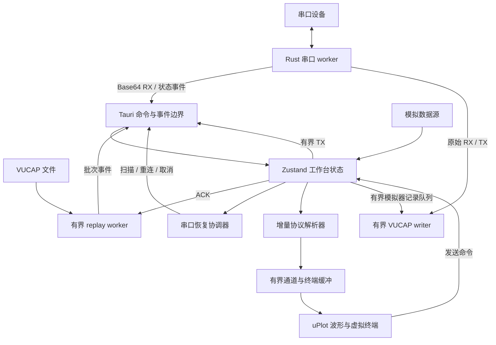
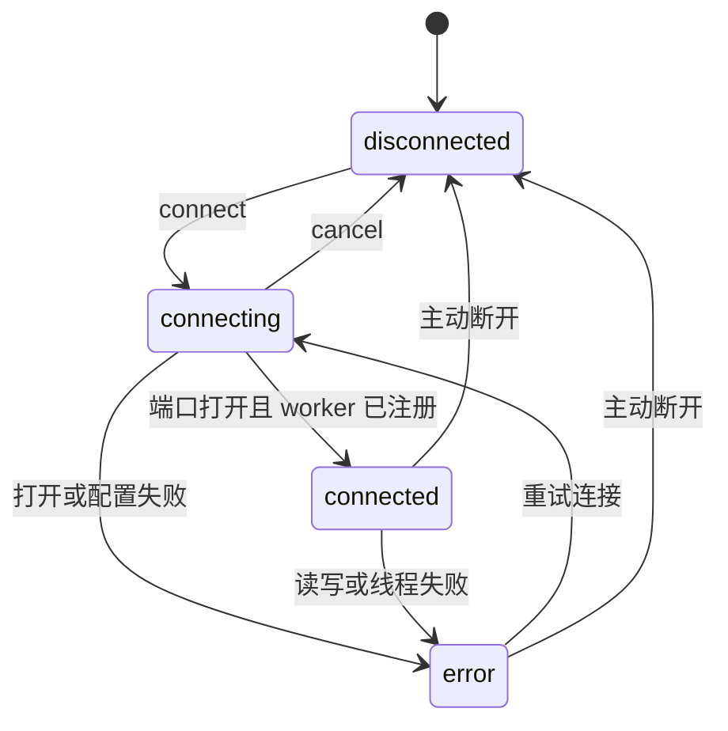

# 架构说明

本文描述 v0.1.0 基础以及已落地的 v0.2 工作区、录制、回放和串口恢复增量。架构目标不是追求模块数量，而是让
串口生命周期、数据所有权和故障语义足够清楚，使后续协议扩展和插件系统可以增量加入。

## 总体结构

- Rust 独占串口句柄，WebView 不直接访问设备资源。
- Tauri 命令负责离散操作，事件负责持续 RX、TX 回执和连接状态。
- 模拟器与真实串口共用 `ingestBytes` 入口，避免维护两套协议和视图逻辑。
- 协议层只输出时间戳和值数组，不依赖 React、Tauri 或具体图表库。

## 串口生命周期

`connect_serial` 把可能阻塞的设备打开和配置放入阻塞任务，避免占用 Tauri 异步执行线程；连接和断开通过独立
生命周期锁串行执行。每个连接请求都有 request token，每个 worker 都有 generation，所有状态变化都带单调递增
的 revision。

连接命令在派发阻塞任务前登记 request token；任务取得生命周期锁后只有 token 仍为当前请求，才推进 generation
并发布 `connecting`。设备打开、DTR / RTS 配置和 worker 注册前后都会同时校验 token 与 generation。连接过程创建
一个等待启动信号的线程，worker 注册到权威状态后才发布 `connected` 并解除启动屏障，因此前端收到连接事件时
已经可以安全发送或断开。

`cancel_serial_connect` 只需要短暂取得共享状态锁，不等待可能正在打开设备的生命周期锁。取消会清除 request
token；已经进入 `connecting` 时还会推进 generation 并发布 `disconnected`。排队、设备打开、线路配置或 worker
注册阶段的迟到结果因此都不能重新发布 `connecting` / `connected` 或注册旧 worker。

命令返回值与异步事件都包含 revision。前端事件订阅只接受严格更新的 revision，避免重复事件重置恢复协调器，
也避免较慢的命令响应覆盖较新的拔插或读写错误。唯一例外是取消命令返回的权威稳定快照：当 revision 相同且本地
仍处于乐观 `connecting` 时，用它恢复连接与事务状态，但不再次驱动恢复协调器。错误状态另外携带稳定
`errorCode`，面向 UI、恢复策略和诊断报告；原始错误文本只用于当前界面提示，不作为程序控制条件。

## 可控串口恢复与诊断

自动重连由前端恢复协调器管理，默认关闭，只能在当前桌面应用运行期显式启用，不写入工作区或 Zustand 持久化
字段。一次手动连接成功后，仅当端口同时具有 USB VID、PID 和非空序列号时才进入待命；恢复目标不包含旧端口名。
身份缺失时保持阻塞状态，不退化为按端口名或同型号设备猜测。

意外运行故障会先等待当前捕获文件完成收尾，再按 `0 / 0.5 / 1 / 2 / 4 / 8 / 16 / 30 / 30 / 30` 秒执行最多
十次恢复。每次尝试重新枚举端口，只连接唯一精确匹配 VID、PID 和序列号的设备，因此同一设备改用新端口名仍可
恢复。无匹配设备会进入下一次退避；多个匹配候选、身份不完整或录制收尾失败都会停止自动选择并明确提示用户。

恢复协调器用 epoch 隔离迟到的枚举和连接 Promise。手动连接、断开、切换数据源或工作区、打开回放和运行时卸载
都会取消当前 epoch；正在连接时还会调用后端取消命令。恢复成功后重置协议 parser、流式 `TextDecoder` 和统计
起点，保留已有波形与终端历史。

诊断使用 256 条内存环，JSON 导出上限为 128 KiB。报告只包含稳定错误码、相对时间、重试计数、generation、
revision 和脱敏串口参数；不包含端口名、USB 序列号、原始错误、绝对路径或 RX / TX 数据。大小超限时从最旧事件
开始裁剪，并保留丢弃计数。

## Worker 调度与边界

worker 使用原子取消标记，断开不需要向可能已满的 TX 队列阻塞写入控制消息。发送数据按 4 KiB 分块，每轮
最多写 32 KiB，之后必须执行一次读取，从而避免持续发送长期饿死 RX。

| 资源 | v0.1 上限 | 目的 |
| --- | ---: | --- |
| 单次串口发送 | 64 KiB | 限制单条命令的阻塞时间与内存占用 |
| TX 队列 | 256 条 | 提供背压，满载时向 UI 返回明确错误 |
| 串口读取块 | 16 KiB | 控制单次事件负载 |
| 通道数量 | 16 | 防止异常帧创建无限序列 |
| 每通道点数 | 2,000 | 固定波形历史内存 |
| 终端记录 | 800 条 | 固定终端历史内存 |
| 单条终端展示 | 2,048 字节 | 避免超大帧撑大 DOM 和字符串 |

当前手工发送面向命令与短帧。大文件传输将在后续版本使用独立的流式任务、进度和取消协议，不通过扩大上述
上限实现。

## 协议与显示

- FireWater 使用流式 `TextDecoder`，按 LF / CRLF 增量切帧，支持 `label:value` 命名通道。
- JustFloat 在字节层查找 `00 00 80 7F` 帧尾，并以小端序解析 `float32`。
- Raw Data 不尝试猜测结构，仅保留终端数据。
- 暂停波形只停止向波形缓存追加，RX、协议解析、终端和统计继续运行。
- 暂停终端只停止创建展示记录，RX、波形和统计继续运行。

终端使用虚拟列表，DOM 数量与视口高度相关，而不是与 800 条缓存上限线性增长。uPlot 只接收当前时间窗内的
对齐数组。

## 安全边界

- capability 仅启用 `core:default` 和 `dialog:allow-open`；Rust 持有选中文件路径，WebView 不具备通用文件系统、
  进程、Shell 或 opener 权限。
- CSP 默认只允许自身资源，并显式禁用 `base-uri`、`object-src` 和 `frame-src`。
- 窗口保持不透明和系统装饰，避免透明窗口带来的可读性与平台兼容问题。
- 主 WebView 不执行动态字符串代码；协议扩展不能依赖 `eval` 或 `new Function`。
- 串口数据视为不可信输入，解析器和展示层都必须保持长度上限。

## 工作区配置边界

Zustand store 同时持有当前工作副本和最多 32 个命名快照，避免两套状态之间发生漂移。工作副本继续持久化，
因此未保存修改可跨刷新恢复；活动快照只在用户明确保存时更新，标题中的未保存状态由结构化配置比较得出，
不是容易遗漏的手工布尔标记。

工作区 v1 保存数据源、协议、串口参数、终端收发格式、行尾、自动滚动、波形时间窗和最多 16 个通道的显隐
偏好。连接状态、generation/revision、端口枚举、波形点、终端记录、统计、暂停状态和输入草稿都属于运行数据，
不会进入快照。

应用快照前必须完成当前数据源的断开；断开失败则保持原配置。应用成功会重置协议解析器、环形缓冲和运行
视图，但绝不自动连接保存的设备。浏览器预览应用串口快照时只把当前工作副本降级到模拟器，命名快照内的
串口配置保持不变，后续保存或另存也不会把原始数据源覆盖成模拟器。切换和删除使用 store 级事务状态，事务
完成前连接、发送、配置修改和其他工作区操作都会被拒绝，避免异步断开期间发生重入覆盖。

导入使用浏览器原生文件选择和 Blob 下载，不扩大 Tauri capability。外部 JSON 上限为 64 KiB，必须精确匹配
格式标识、schema 版本和字段集合；名称、枚举、串口参数及通道键都会重新校验并重建，未知字段不会传播到
运行状态。旧版单工作区持久化数据在 v0 到 v1 迁移时生成“默认工作区”快照；高于当前版本的数据拒绝降级并
保持只读，旧客户端不会覆写未来格式。实时 RX 更新会复用未变化的配置引用，跳过重复 JSON 序列化和
`localStorage` 写入。

## 原始会话录制

`.vucap` 记录平面独立于 Zustand、终端虚拟列表和波形环形缓冲。原生串口 worker 在 Base64 事件之前投递 RX，
每次 `write` 成功后投递实际写入的 TX 字节分片；投递只使用按记录数和 payload 字节数双重限制的 `try_send`，
不会等待磁盘。连续 TX record 按顺序拼接后才是线上的 TX 字节流，record 边界不表示一次发送命令。独立
writer 线程负责格式编码、定期进度事件、flush、同步和完成 footer。

录制开始时冻结数据源、协议、串口参数、Unix 起始时间和单调时钟基准。记录只保存相对单调微秒时间，避免
系统时钟跳变影响后续回放排序。Tauri 模拟器通过前端 1 MiB 有界队列串行调用同一 recorder；浏览器预览不
模拟文件落盘。暂停终端或波形只影响视图缓存，不影响录制。

磁盘写入错误、writer panic 或队列溢出会把 capture 状态置为 `error` 并留下无 footer 的未完成文件，串口连接
继续运行。主动停止、断开和工作区切换则串行等待 writer 收尾。格式 reader 逐条读取并限制头部与单条记录为
64 KiB，可区分未知版本、损坏、截断和正常完成；详见 [VUCAP 捕获文件格式](capture-format.md)。

## 有界历史回放

回放是独立的非持久化运行模式，不加入工作区 `DataSource`。打开文件后，Rust worker 先流式扫描并验证版本、
footer 统计和时间戳单调性；缺少 footer 或尾部截断只开放已验证的完整记录前缀，其他损坏进入 `error`。
扫描不建立索引，播放时重新打开文件并只保留 `CaptureReader`、一个 lookahead record 和一个待确认批次。

每个批次最多 128 KiB、128 条记录或 16 ms 捕获跨度，同时最多存在一个未 ACK 批次。`sessionId + generation +
sequence` 共同隔离停止、重播和迟到事件；新 generation 先等待 `sequence=0` 启动 ACK，再以单调时钟按 1×
调度。暂停、停止和关闭通过可唤醒控制通道打断定时或 ACK 等待，不依赖不可中断的长时间 sleep。

前端使用独立增量协议 parser、RX decoder 和流式 TX decoder，一批数据只提交一次 Zustand 更新。RX 进入协议、
波形、终端和统计，TX 只进入终端和统计；显示时间由捕获起始 Unix 时间加相对微秒时间计算。播放不会修改
工作区协议，连接、录制、回放和工作区切换由同一个同步占用的运行事务状态串行化。

## 故障语义

- 端口打开或参数配置失败：命令返回可读错误，状态进入 `error`。
- 队列满或单次发送过大：只拒绝当前发送，不破坏现有连接。
- 设备移除或读写失败：worker 发布带稳定错误码的 `error` 并停止；已待命的恢复协调器按身份开始有界重试，下一次
  连接会先回收旧线程。
- worker panic：`join` 错误不会静默丢弃，权威状态进入 `error`。
- 浏览器预览：串口入口禁用，只允许使用模拟器。

## 验证层次

1. Vitest 覆盖字节编解码、跨 chunk 协议解析、环形缓冲、状态 revision、恢复退避、身份匹配和迟到结果隔离。
2. React 组件测试覆盖主要空状态、工作区命名、恢复控制和操作入口。
3. Playwright 覆盖模拟器端到端链路、TX 回显、Canvas 有效像素、工作区文件往返、录制入口权限、虚拟列表、
   窄屏溢出、短窗口布局和同一 USB 设备跨端口名恢复。
4. GitHub Actions 在三个桌面系统执行 rustfmt、Clippy 和 Rust 测试，在 Node.js 22 上执行前端检查和浏览器
   验收。
5. 正式发布前必须补充真实串口的长稳、拔插、流控和高波特率测试。

## 扩展原则

新协议先实现无副作用的增量解析器和夹具测试，再注册到 UI。工作区、记录回放和插件系统必须复用同一数据
平面，不允许绕过缓存上限。节点图仅适合可选的高级数据处理，不应成为基础收发、波形或协议配置的前置条件。
