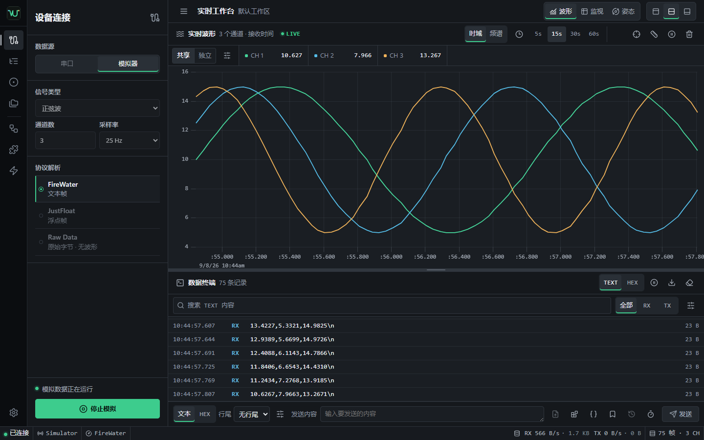

# 用户手册

本手册面向使用 Vofa-Ultra 进行串口收发、实时观察、采集和回放的用户。协议字节格式、文件格式和内部边界分别见
[内置协议贡献契约](protocols.md)、[实验性 Wasm 扩展](extensions.md)、[VUCAP 捕获文件格式](capture-format.md)和
[架构说明](architecture.md)。



## 运行模式

Vofa-Ultra 有两种运行模式：

- 桌面应用：可访问本机串口、实验性 Wasm 扩展、录制、数值记录、回放和文件导出。
- 浏览器预览：只使用模拟器，适合体验界面和验证协议链路；不能访问本机串口或原生文件任务。

当前项目尚未发布经过签名和完整硬件验证的稳定安装包。使用 Actions 候选包时先核对 `SHA256SUMS`，并阅读
[发布流程](release-process.md)中的未签名限制。开发环境启动方式见 [README](../README.md#快速开始)。

## 五分钟开始

### 使用模拟器

1. 打开“连接”，确认数据源为“模拟器”。
2. 选择 FireWater 或 JustFloat；首次体验建议使用 FireWater。
3. 点击“启动模拟”。状态栏应显示已连接、Simulator、当前协议和持续增长的 RX 字节/帧数。
4. 在“波形”查看实时曲线，在“数据终端”查看 RX 文本或 HEX。
5. 在发送栏输入内容并点击“发送”；模拟器会走与桌面端相同的发送、终端和统计链路。

### 连接串口

1. 使用桌面应用，打开“连接”，选择“串口”。
2. 点击“刷新串口列表”，选择设备。
3. 按设备文档设置波特率、数据位、校验、停止位、流控、DTR 和 RTS。
4. 选择协议，再点击“连接设备”。
5. 先在终端确认 RX 原始内容，再判断结构化协议和波形是否正确。

连接、录制收尾、回放或工作区切换期间，相关配置会暂时锁定。要修改串口参数，先断开当前数据源。

## 界面区域

左侧导航依次为“连接”“通道”“处理”“扩展”“自动化”“记录”“工作区”“设置”。再次点击当前导航项可收起侧栏。
主工作区上方可切换“波形”和“姿态”，下方始终是“数据终端”，底部状态栏显示连接、来源、协议、吞吐和帧数。

“波形/姿态”标签支持 `ArrowLeft`、`ArrowRight`、`Home` 和 `End`。工作区确认对话框支持标准 Tab 导航和
`Escape` 取消。

## 选择协议

| 协议 | 适用输入 | 波形 | 回放定位 |
| --- | --- | --- | --- |
| FireWater | 每行 1 到 16 个数值，可使用 `label:value` | 支持 | 吸附到下一 RX 换行边界 |
| JustFloat | 1 到 16 个小端 `float32`，以 `00 00 80 7F` 结尾 | 支持 | 吸附到下一完整帧尾 |
| Raw Data | 任意原始字节 | 不生成通道 | 吸附到记录边界 |

协议在实时链路和回放中使用独立 parser。切换协议会清理旧半帧和相应诊断，不会把未知协议当作 Raw。

## 使用实验性 Wasm 扩展

扩展只在桌面端和已连接的实时数据源中可用。打开“扩展”，选择本地 `.vux` 后，应用先校验包格式、manifest、
Wasm 结构和摘要，并显示包/模块 SHA-256。当前包未签名，摘要不能证明作者身份；确认来源和构建证据后，再勾选
“授权未签名扩展读取实时 RX”并启用。授权只对本次会话有效。

扩展异步读取原始 RX 的副本，结果显示在“通道”的独立扩展分组和波形中。它不会替换当前内置协议：如果选择
FireWater 或 JustFloat，会同时看到内置和扩展通道；希望基础 parser 不产生波形时可选择 Raw。扩展帧不计入基础
`rxFrames` 或协议健康度，也不进入处理图、姿态、数值 CSV、VUCAP、回放或工作区。

“重置”只清 guest 流式状态和扩展波形，并从新 generation 开始；“停用”会清除授权。切换协议、数据源、连接、
工作区、进入回放或关闭运行环境也会自动撤权。路径、manifest、哈希、授权、故障、通道显隐和会话状态均不保存，
重启后必须重新选择。RX 可能含密钥、设备标识和客户数据，只加载已审查来源。ABI、资源上限和信任模型见
[实验性 Wasm 协议扩展](extensions.md)。

## 接收、通道与波形

“数据终端”的 TEXT/HEX 切换只改变显示方式，不改变接收到的字节。筛选栏左侧的“块/行”控制 RX 记录方式：

- “块”是默认兼容模式，每个底层读取块立即成为一条记录。
- “行”按所选 LF、CRLF 或 CR 聚合原始字节，允许行、行尾和多字节字符跨越多个读取块；完整后才显示。
- “接收文本编码”可选 UTF-8、GB18030 或 Windows-1252，同时作用于实时与回放 RX 的后续 TEXT 记录；HEX 和
  已有记录不会改变。切换编码会先用旧编码结算当前残行，再从新的解码状态继续。
- 行记录以首个读取块的时间戳为准，行尾计入记录长度和字节数。正文最多保留 2048 字节，并可完整附带最多 2
  字节 CRLF；更长的无行尾输入会分段，无损连续数据以 VUCAP 为准。
- 已确认正文超过 2048 字节仍未遇所选行尾时，前 2048 字节会自动形成分段，并在记录右侧显示警示图标；记录
  在暂停、连接结束或模式边界处仍未闭合时，也会保留残片并警示。

暂停终端会先把当前 RX 残行保存为可见警示记录，之后只停止追加记录；暂停期间的 RX/TX 不会在恢复后补录，
协议解析、波形处理、录制和诊断仍继续。恢复后从新记录开始。切换块/行或接收行尾也会先结束当前残行；“清空
终端”则会连同待聚合残片一起丢弃。实时与回放各自使用独立聚合状态，回放应用相同的终端显示规则。

RX 记录方式和文本编码只改变终端展示，不改变 FireWater/JustFloat parser、处理、统计、自动应答、扩展或 VUCAP
原始记录边界。TX 文本仍固定使用 UTF-8；编码选择不会改变设备命令字节。
终端最多保留 800 条记录，超出后从最旧项开始淘汰。单条记录的 HEX 最多保留前 2050 字节，TEXT 最多保留前
2050 个解码字符，超出部分显示省略号。

搜索框对当前 TEXT 或 HEX 的已显示负载执行大小写不敏感的字面量匹配，`.`、`*`、`[` 等字符没有正则含义；
“全部/RX/TX”可进一步限制方向。宽屏标题同时显示命中数与当前保留总数；查询和方向不写入工作区，切换
TEXT/HEX 会按新的显示内容重新匹配。筛选检查完整的已显示负载，但每条只高亮前 64 处命中，避免重复字符生成
无界 DOM 节点；搜索无法访问单条省略号之后未保留的内容。

“导出终端记录”始终导出 800 条上限内的当前保留记录，搜索和方向过滤不会缩小导出范围，因此仍不能替代无损
捕获；需要保留完整原始字节时使用 `.vucap` 录制。“清空终端”也作用于全部保留记录和待聚合 RX 残片，但不会
清除波形或捕获文件。

“通道”显示基础通道、处理图派生通道和解析健康度。可单独隐藏通道；隐藏只影响显示，不会阻止解析或数值记录。
FireWater/JustFloat 的健康度会给出成功、丢弃、重同步、最近原因和时间；Raw 显示“不适用”。“清空解析统计”
只重置计数和最近原因，不会丢弃正在等待完成的半帧。

“波形”提供 5、15、30、60 秒窗口、暂停、清空、单次触发和测量。

单次触发：

1. 保持实时串口或模拟器已连接，点击准星图标打开触发设置。
2. 选择一个基础或派生通道、上升沿或下降沿，并填写有限阈值后点击“布防”。
3. 越过阈值后，应用继续采集半个当前时间窗；截止批次完整写入后显示 `HISTORY`，图中的 `T` 标出触发时刻。
4. 点击“重新布防”恢复实时追加并开始下一次捕获；等待期间可点击“解除”。

当前时间窗就是总捕获窗，正常历史深度足够时触发点位于窗口中央。冻结只停止波形追加，RX、解析、处理、姿态、
终端、统计、VUCAP 和数值日志继续。触发不支持回放或 `extension:*` 通道，也不写入工作区。暂停/继续、测量、
框选历史、清图、改变时间窗、协议、来源、处理图、连接、工作区或回放边界都会解除当前触发。

双游标测量：

1. 在实时图中沿 X 轴框选可查看历史细节；缩放后点击“回到实时波形”恢复最新时间窗。
2. 至少取得两个有效采样点后，点击直尺图标“开启波形测量”。
3. 选择基础或派生通道，再在图中点击或移动 A/B 游标。
4. 读取 `tA`、`tB`、`Δt`、`1/Δt`、`yA`、`yB` 和 `Δy`。
5. 再次点击直尺关闭。测量会冻结视口，但数据链路仍在运行。

框选只挂起视口跟随，`LIVE`、RX、解析、处理、终端、统计、录制和数值日志都继续运行。挂起时图表使用当前
2,000 点/通道上限内的全部保留数据，最旧点仍会按环形上限淘汰。改变时间窗、暂停/继续、进入测量、清空波形，
以及切换协议/来源/处理图/工作区/回放会话或时间线会恢复跟随。后六类边界也会结束当前测量，避免游标引用旧数据。

## 发送命令

发送栏支持 TEXT、HEX 和无行尾/LF/CR/CRLF。CR-only 适用于部分 AT 命令设备；无论 TEXT 还是 HEX，行尾都在
内容之后追加。HEX 输入使用完整字节，例如 `01 03 00 00 00 02 C4 0B`；非法字符、
半个字节、空内容或展开后超过 64 KiB 会在发送前拒绝。

命令参考弹层的“变量”页可插入序号和时间。TEXT 示例：

```text
SET,${seq},${unix_ms}
```

HEX 变量必须指定定宽格式：

```text
AA 55 ${seq:u16le} ${task_unix_ms:u64be}
```

同一弹层的“ASCII”页列出 0..127，可按字符、控制字符缩写、DEC、HEX 或中文名称过滤。查询 `CR`、`0D`、
`13` 或“回车”都会定位同一项；该页面只查询，不会插入不可见控制字节、切换发送格式、修改草稿或产生 TX。

“校验”页使用独立输入，TEXT 按 UTF-8 编码，HEX 接受与发送栏相同的完整字节和常见分隔符。页面显示
CRC-16/MODBUS 数值与低字节在前的线序、CRC-32、XOR-8、SUM-8 和实际字节数；不包含发送栏行尾，也不会
修改草稿、发送格式、历史或 TX。输入文本最多 256 KiB，解码后最多 64 KiB；该页只计算，不自动附加或验证帧尾。

“转换”页在 HEX 字节和十进制数值列表之间互转，支持 `u8/i8/u16/i16/u32/i32/f32/f64` 以及
显式 LE/BE。例如，`00 00 80 3F` 按 LE `f32` 解码为 `1`，`-2` 按 BE `i16` 编码为 `FF FE`。
转换前会拒绝半字节、未按类型对齐的 HEX、空数值项、非整数、整数越界、非有限浮点值和浮点溢出。
输入文本最多 256 KiB，参与转换的字节数据最多 64 KiB，单个数值 token 最多 128 个字符。

该页不读取实时 RX，不会把结果填入处理图、发送草稿或隐式发送；只有显式点击复制按钮才会访问剪贴板。
处理图中的字节/数值转换使用独立固定节点，不会自动读取或同步该弹层的输入。

成功进入发送队列的手动/周期命令才会进入会话历史。连续相同命令会合并；历史最多 100 条且原始输入合计
256 KiB。使用历史菜单，或在输入框第一行按上键、最后一行按下键浏览。历史、草稿和任务状态不会持久化。

展开“周期发送设置”可选择 20 ms 到 24 小时整数间隔，以及有限次数或持续模式。第一次立即发送，后续间隔从
上一次发送完成后开始，不会追赶遗漏周期。停止、断连、故障、换源、切工作区或进入回放都会取消后续发送。
完整变量和调度语义见[安全命令模板](command-templates.md)。

### 原始文件发送

桌面应用连接真实串口后，点击发送栏的文件图标：

1. 点击“选择”并选择一个普通本机文件。此时只建立草稿，不会读取或发送文件。
2. 核对文件名后点击“开始发送”。文件字节原样写入，不应用 TEXT/HEX、命令变量或行尾转换。
3. 在弹层查看实际已写入字节、总字节和进度；需要停止时点击“取消”。
4. 只有全部字节写入且串口 `flush` 成功后才显示完成。0 字节文件也会完成并显示 100%。

同一时间只允许一个文件任务，并与手动发送、周期发送、自动应答和 Modbus RTU 事务互斥。成功写入的字节会进入
TX 终端、传输统计和正在进行的 VUCAP 捕获，但不会进入手动命令历史。完整路径只在当前组件草稿、一次启动 IPC
调用和 Rust 打开文件期间使用，不进入工作区、前端 Store 或串口诊断；状态事件只包含文件名。

取消会阻止后续读取和写入，但驱动已经接受并缓冲的字节仍可能到达设备。断连、换源、切换工作区、进入回放和
关闭运行环境都会取消活动任务。当前功能是无封装原始字节流，不提供协议握手、确认、限速、续传、重试、校验
确认或文件接收；需要可靠升级时，应使用设备明确支持的 XMODEM、YMODEM、自定义 bootloader 协议或其他传输层。

### 快捷命令

点击发送栏的书签按钮管理当前工作区的命名快捷命令：

1. 在发送框准备原始模板、TEXT/HEX 格式和行尾。
2. 打开快捷命令，输入名称并点击保存图标。
3. 点击命令主体只把保存内容载入发送框；核对后再点击“发送”或启动周期发送。
4. 使用铅笔、上下箭头和删除图标重命名、排序或删除。

载入不会展开变量、写串口、生成 TX 或加入命令历史。空模板只能与 LF/CR/CRLF 行尾组合保存。每个工作区最多 32 条，
名称最多 64 个字符，全部模板 UTF-8 合计最多 128 KiB；列表顺序随工作区保存和导出。快捷命令不同于会话历史，
会进入本机持久化状态和工作区 JSON，切换工作区时随配置一起恢复。

### Modbus RTU 单事务主站

点击发送栏的积木按钮打开构帧器：

1. 选择 `01/02/03/04/05/06/0F/10` 功能，填写站号和 0-based 地址。
2. 读操作填写数量；单写填写一个值；多写使用逗号、分号或空白分隔值，寄存器值可用十进制或 `0x` 十六进制。
3. 核对帧预览、字节数和 CRC。
4. 只想编辑原始命令时，点击“填入发送框”，再用原“发送”按钮确认或配置周期发送。
5. 需要关联响应时，设置 `100..60000 ms` 响应超时并点击“执行事务”。
6. 在“事务结果”查看位、寄存器、写确认或设备异常；展开记录可核对原始 TX/RX，最多保留最近 32 条。

填入动作不会写串口或产生历史，只把发送格式切到 HEX、行尾切到“无行尾”并替换草稿。执行事务需要已连接的
实时来源；应用等待 RTU 总线静默后发送一次请求，随后关联跨分片响应，并区分完成、设备异常、超时、取消和协议
错误。站号 `0` 仅用于写广播，发送完成即结束；读取广播会被拒绝。地址范围、标准数量上限和多值字节数在前后端
都会校验，不会截断或回绕。

一次只能运行一个事务。事务期间手工发送、周期发送和自动应答互斥；可以显式取消，但请求已经发出时，写操作
仍可能已在设备执行。断连、重连、切换来源/工作区和退出运行环境也会结束当前事务。原始 TX/RX 继续显示在终端
并进入统计和 VUCAP；事务结果只存在于当前会话，不写入工作区，也不进入手工命令历史。

当前没有轮询器、寄存器地图、自动重试或 Modbus TCP。真实 RS-485 的本地回显、半双工方向控制和时序差异必须
使用目标适配器与设备验证，不能用浏览器模拟器结果代替。

## 数据处理

“处理”使用列表式有向无环图。典型流程是：

1. 添加 `input`，选择一个基础通道。
2. 添加 `affine`、`clamp`、`ema`、`moving_average`、`math` 或字节/数值转换节点，选择上游并设置参数。
3. 添加 `output`；稳定 ID 由应用生成，再设置名称和颜色。
4. 打开处理图开关，在“通道”和波形中查看 `derived:<output-id>`。

节点引用必须指向前置非输出节点；重复 ID、循环、无效参数和超限图会被拒绝。若运行预算或意外错误触发熔断，
基础 RX、终端、录制和基础波形继续工作；修复配置后点击“重试处理图”。

“字节转数值”按类型宽度配置 1/2/4/8 个输入，并按界面顺序和 LE/BE 在同一个解析帧内解码；每个输入必须是
`0..255` 的整数，不会把相邻帧补成一个值。“数值拆字节”把一个标量编码后选择 B0..B7 中的一个输出，需要完整
字节序列时建立多个节点。非法或缺失输入只让当前帧没有对应派生点，两类节点均不会发送串口数据。

## RX 自动应答

“自动化”用于有界 RX 自动应答：

1. 点击“添加自动应答规则”，填写名称。
2. 选择 TEXT 或 HEX 触发内容；匹配针对实时 RX 原始字节，可跨接收分片。
3. 配置响应模板、发送格式、行尾和冷却时间，再保存规则。
4. 按列表顺序启用需要的规则，然后启动自动应答。

规则随工作区保存，运行状态不保存。回放不会触发应答；周期发送与自动应答互斥。队列、单批匹配或模板边界等
故障会清空待发送项并停机；达到会话次数上限时则停止接受新匹配，完成已进入队列的响应后停机。两者都不会断开
串口。响应 TX 会进入终端、统计和 VUCAP，不进入手动命令历史。

## 录制与数值记录

“记录”面板包含四个标签，术语含义固定如下：

- “录制”：保存原始 RX/TX 和时间线标记到 `.vucap`。
- “数值”：保存 FireWater/JustFloat 的基础与派生有限数值到长表 CSV。
- “回放”：读取 `.vucap` 并重建终端、波形、处理和姿态链路。
- “导出”：把 `.vucap` 转为 CSV、JSONL 或单向 BIN。

桌面端连接数据源后，点击“开始录制”。录制期间可填写标记名称、选择颜色并点击“添加时间线标记”。正常停止会
刷新、同步并写入完成 footer。默认目录是系统下载目录的 `Vofa-Ultra`；不可用时回退到应用数据目录的
`recordings`。异常中止可能留下没有 footer 的文件，它仍可用于恢复已验证前缀。

“数值”仅适用于已连接的 FireWater/JustFloat，可与原始录制并行。写入期间文件为 `.csv.part`，正常停止后提交为
`.csv`；正常关闭应用也会先排空待写样本并完成原始录制与数值 CSV。失败或关闭收尾超时会保留部分文件供诊断，
不会把不完整内容改名为 `.csv`。Raw Data 不产生数值通道。

## 回放与导出

在“回放”选择捕获文件，或使用“回放最近录制”。取消文件选择不会改变当前会话；选定文件后，应用会安全完成
录制、断开实时来源并检查文件。回放支持播放、暂停、继续、停止、重新播放、关闭和五档倍速。

时间轴只能在就绪、暂停或完成状态提交定位。FireWater/JustFloat 会吸附到协议安全边界，因此实际位置可能向后
移动；播放期间先暂停再定位。v2 文件的标记列表也在这些状态下可点击定位。

“导出”流程：

1. 选择捕获文件或最近录制。
2. 选择 CSV、JSONL 或 BIN。
3. 选择双向、仅 RX 或仅 TX；BIN 必须是单一方向。
4. 对不完整文件，只有确认“允许导出不完整文件的有效前缀”后才能继续。
5. 点击开始并选择目标位置。提交阶段不能取消，以避免替换目标时留下不确定状态。

CSV 面向逐记录检查，JSONL 保留元数据、Base64 payload、v2 标记和摘要，BIN 只拼接所选方向的原始 payload。

## 工作区

工作区保存来源、协议、串口参数、显示/发送格式、TX 行尾、RX 记录方式与接收行尾、时间窗、自动滚动、通道
显隐、处理图、姿态映射、自动应答规则和命名快捷命令。“保存”更新当前工作区，“另存为”创建新副本。波形
触发配置与运行阶段不保存。切换时
如有未保存更改，应用会要求确认。

删除工作区需要确认，且始终至少保留一个工作区。删除当前工作区时，应用会先安全切换到相邻工作区；运行中的
回放、录制和实时来源仍遵循下述切换收尾规则。

应用工作区前会关闭回放、完成录制、断开当前来源并清空运行数据；不会自动连接保存的设备。连接状态、波形点、
终端历史、命令历史、传输统计、处理运行状态、冻结/归零姿态和自动应答运行状态不进入工作区。

“导出当前”使用当前名称草稿和工作副本生成严格的 v9 JSON，包括尚未保存的配置，但不会执行保存或改变“未保存”
状态。已保存列表中的下载按钮只导出对应的命名快照。v1-v8 导入会校验并迁移，同名项目会生成编号副本且不会
自动应用。未来版本的本地配置会触发只读保护，当前版本不会覆盖原数据。详见
[兼容性与弃用政策](compatibility.md)。

## 3D 姿态

切换到“姿态”，点击“配置姿态通道”：

1. 选择 Euler 或 Quaternion。
2. 映射 Roll/Pitch/Yaw 或 W/X/Y/Z；名称明确时可用“自动映射姿态通道”。
3. Euler 选择 deg/rad；再选择 ENU/FLU 或 NED/FRD 坐标约定。
4. 等待同一完整协议帧提供所有映射值。

工具栏支持冻结显示、以当前姿态归零、取消归零和复位三维视角。这些都是视图状态，不写入工作区。WebGL 创建
失败时仍保留配置与数值读数；运行中显卡 context 丢失会暂停三维渲染，浏览器恢复后自动继续。

## 自动重连与诊断

自动重连默认关闭，仅桌面串口可用。手动连接成功后，只有设备同时提供 USB VID、PID 和非空唯一序列号，协调器
才会待命。意外读写故障后会完成录制收尾，再进行最多十次有界重试；设备端口名变化不影响强身份匹配。

身份缺失、多候选、录制收尾失败或重试耗尽时不会猜测设备。用户可随时取消并手动选择。“导出串口诊断”生成
有界脱敏 JSON，不含端口名、序列号、原始错误、绝对路径或收发内容；提交前仍需人工检查。

## 设置与数据边界

“设置”可切换深浅主题、波形时间窗、终端自动滚动，并重置传输统计。主题单独保存在本机；其余可配置项按
工作区规则保存。启用终端自动滚动时，向上滚动会临时挂起跟随；手动滚回底部或点击“回到最新记录”即可恢复。
挂起跟随不会暂停 RX 或丢弃终端记录。关闭自动滚动后，“回到最新记录”只跳转一次，不会重新开启持续跟随。
暂停、清空或重置统计只影响对应视图，不会停止串口 worker。

串口数据可能包含密钥、设备标识或业务内容。分享终端导出、捕获文件、截图或诊断前，遵循[安全策略](../SECURITY.md)
完成脱敏。快捷命令模板同样可能包含敏感内容，会保存在本机并进入工作区导出，但不会进入串口诊断；分享工作区
JSON 前也必须检查并脱敏。遇到问题先查看[故障排查矩阵](troubleshooting.md)；设备是否经过真实验证见
[硬件兼容性清单](hardware-compatibility.md)。
